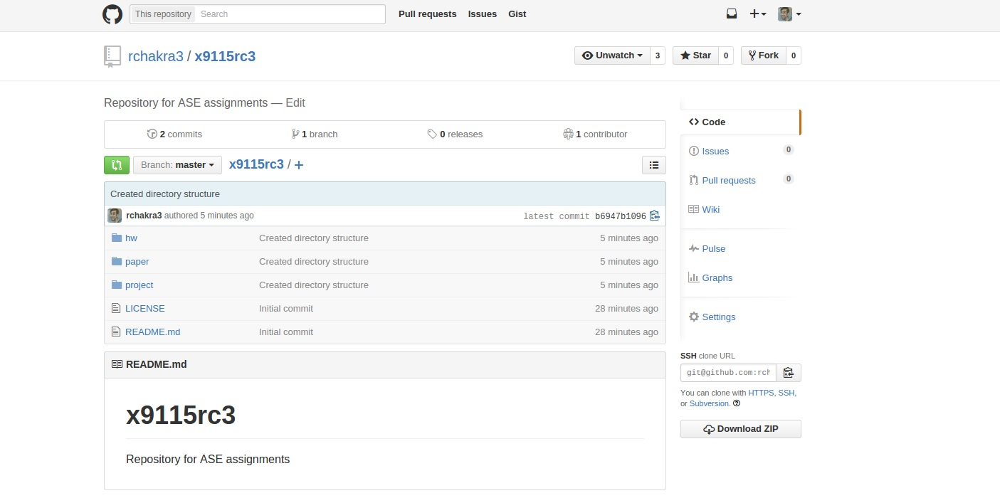
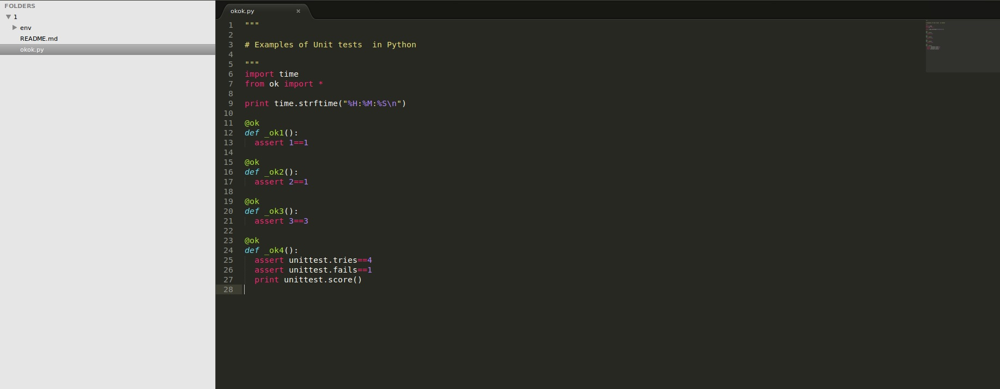
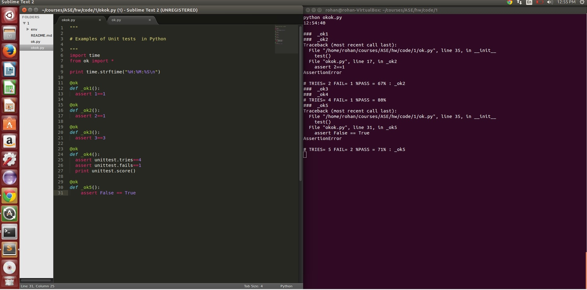

# ASE Code 1

### A screen snap of the top level of your repo



### Output of the commands python --version, pip help, easy_install -h

```
(env)rohan@rohan-VirtualBox:~/courses/ASE/hw/code/1$ python --version
Python 2.7.6
(env)rohan@rohan-VirtualBox:~/courses/ASE/hw/code/1$ pip help

Usage:   
  pip <command> [options]

Commands:
  install                     Install packages.
  uninstall                   Uninstall packages.
  freeze                      Output installed packages in requirements format.
  list                        List installed packages.
  show                        Show information about installed packages.
  search                      Search PyPI for packages.
  wheel                       Build wheels from your requirements.
  zip                         DEPRECATED. Zip individual packages.
  unzip                       DEPRECATED. Unzip individual packages.
  bundle                      DEPRECATED. Create pybundles.
  help                        Show help for commands.

General Options:
  -h, --help                  Show help.
  -v, --verbose               Give more output. Option is additive, and can be used up to 3 times.
  -V, --version               Show version and exit.
  -q, --quiet                 Give less output.
  --log-file <path>           Path to a verbose non-appending log, that only logs failures. This log
                              is active by default at /home/rohan/.pip/pip.log.
  --log <path>                Path to a verbose appending log. This log is inactive by default.
  --proxy <proxy>             Specify a proxy in the form [user:passwd@]proxy.server:port.
  --timeout <sec>             Set the socket timeout (default 15 seconds).
  --exists-action <action>    Default action when a path already exists: (s)witch, (i)gnore, (w)ipe,
                              (b)ackup.
  --cert <path>               Path to alternate CA bundle.
(env)rohan@rohan-VirtualBox:~/courses/ASE/hw/code/1$ easy_install -h

Global options:
  --verbose (-v)  run verbosely (default)
  --quiet (-q)    run quietly (turns verbosity off)
  --dry-run (-n)  don't actually do anything
  --help (-h)     show detailed help message
  --no-user-cfg   ignore pydistutils.cfg in your home directory

Options for 'easy_install' command:
  --prefix                   installation prefix
  --zip-ok (-z)              install package as a zipfile
  --multi-version (-m)       make apps have to require() a version
  --upgrade (-U)             force upgrade (searches PyPI for latest versions)
  --install-dir (-d)         install package to DIR
  --script-dir (-s)          install scripts to DIR
  --exclude-scripts (-x)     Don't install scripts
  --always-copy (-a)         Copy all needed packages to install dir
  --index-url (-i)           base URL of Python Package Index
  --find-links (-f)          additional URL(s) to search for packages
  --build-directory (-b)     download/extract/build in DIR; keep the results
  --optimize (-O)            also compile with optimization: -O1 for "python -
                             O", -O2 for "python -OO", and -O0 to disable
                             [default: -O0]
  --record                   filename in which to record list of installed
                             files
  --always-unzip (-Z)        don't install as a zipfile, no matter what
  --site-dirs (-S)           list of directories where .pth files work
  --editable (-e)            Install specified packages in editable form
  --no-deps (-N)             don't install dependencies
  --allow-hosts (-H)         pattern(s) that hostnames must match
  --local-snapshots-ok (-l)  allow building eggs from local checkouts
  --version                  print version information and exit
  --no-find-links            Don't load find-links defined in packages being
                             installed

usage: easy_install [options] requirement_or_url ...
   or: easy_install --help


```
### A screen shot of what it looks like to write code in your preferred Python IDE (hint: need to see syntax highlighting):



### A screenshot of output of your okok.py test:


