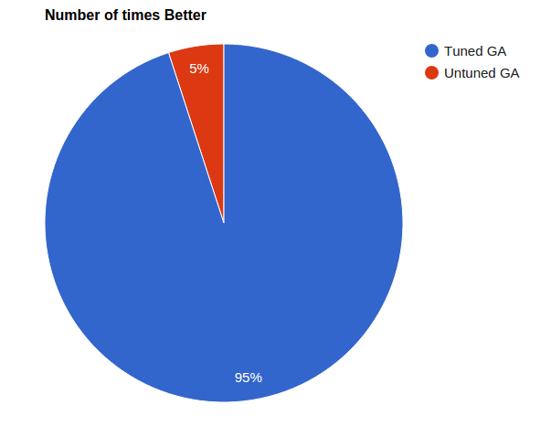
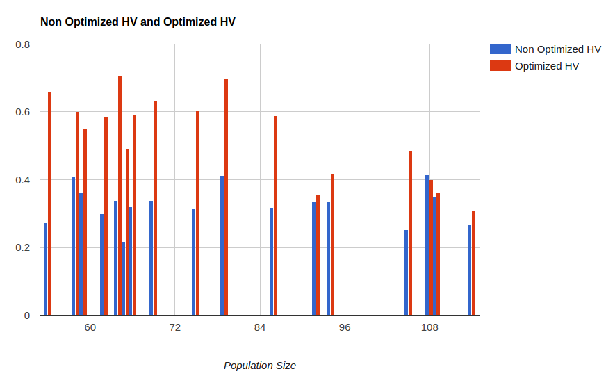
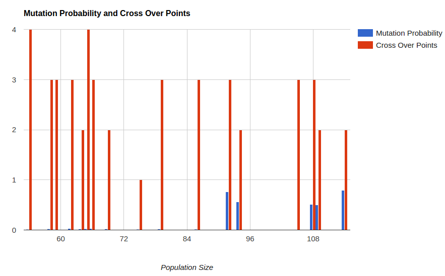

## Tuning Parameters for a GA

### Abstract
The aim of this experiment is to improve on the results of experiment 9 by tuning the parameters of the Genetic Algorithm and running it against a model that did not originally perform very well to see if the results could be improved. 

### Introduction
#### Genetic Algorithms

Genetic Algorithms (GA) are search algorithms that mimic the process of natural evolution where each individual is a candidate solution: individuals are generally raw data in whatever encoding format has been defined. They usually consist of a fitness function to select solutions that have a high probability of generating better quality next-generation solutions.

Genetic algorithms are inherently pluggable and easily modified. Basic parameters that can be changed include the probability of mutating or modifying solutions, the method of modifying the solutions, the degree of crossover (or mix and match between candidates), the fitness function used to compare candidates and the population size.

In this experiment, I have modified the number of crossover points and the probability of mutation over different population sizes.

#### Differential Evolution
DE optimizes a problem by maintaining a population of candidate solutions and creating new candidate solutions by combining existing ones according to a formula which depends on the variation of DE being used, and then keeping whichever candidate solution has the best score or fitness on the optimization problem at hand. Such methods are commonly known as metaheuristics as they make few or no assumptions about the problem being optimized and can search very large spaces of candidate solutions.

In this experiment, I have used DE/rand/1:
   - Extrapolate from some candidate X, chosen at random.
   - Add in values from one other extrapolation (Y-Z)

DE is used to try and optimize the parameters of the GA to get better results for DTLZ5 with 10 decision values and 2 objective functions

I have used binary domination as the method for comparing the fitness of 2 possible candidates. 

#### Selection
   - The first step in a GA is selecting candidates from the existing population which will be used as the basis to generate one or more child candidates
   - The idea is to use candidates with a high fitness function so as to better the next generation

#### Crossover
   - The process of taking parts from different candidates in the parent population and merging them to form a new child
   - In this experiment I have only used a single crossover point
   - In the next experiment, I have attempted to improve the overall performance by tweaking the number of crossover points between 1 and 5


#### Mutation
   - Randomly tweaking values of decision variable in the parents being used
   - Default value used is 0.05


#### Binary domination
   - Candidate A dominates B iff every decision value in A is less than or equal to the decision value in B AND there is at least one value which is less.


##### DTLZ
   
   - A model family that can contains a variable number of objective functions and decision variables
   - Designed to stress test optimizers
   - The idea is to minimize all the objectives


##### Pareto Frontier

   - The pareto frontier is defined by a set of values in the search space beyond which it is not possible to optimize a particular objective without negtively affecting another objective


#### Hypervolume 
   - This is a measure of the number of candidates that are dominated by the pareto frontier.
   - 100% indicates that the candidates on the pareto frontier dominate all other candidates
   - I've used the Monte Carlo method of calculating the hypervolume:
      - Generate a large number of valid candidates
      - Calculate the percentage of these that are dominated by candidates on the pareto frontier


### Pseudo Code

```
N = population size
P = create parent population by randomly creating N individuals

while not DONE:
    C = create empty child population
    while not enough indivs in C:
        parent1 = select parent from P***SELECTION
        parent2 = select parent from P***SELECTION
        child1, child2 = crossover(parent1,parent2)
        mutate child1, child2
        evaluate child1, child2 for fitness
        insert child1, child2 into C
    end while
    P = C


mp => Defaults for mutation: at probability 5%
cop=> Defaults for number of crossover points: one point (i.e. pick a random decision, take all dad's decisions up to that point, take alll mum's decisions after that point)
select=> Defaults for select: for all pairs in the population, apply binary tournament domination.
population_size=> Defaults for number of candidates: 100
num_generations=> Defaults for number of generations: 1000 (but have early termination considered every 100 generations)
```

### Implementation

My implementation of a Genetic Algorithm follows the above pseudo code very closely with the following details:

   - Default values:
      - Population Size: 100
      - Number of Generations: 1000
      - Probability of Mutation: 5%
      - Number of Crossover points: 1

   - Selection is done using Tournament Selection with k=2 [3], while ensuring the two parents are distinct

   - Crossover is done by choosing a single arbitrary decision number d. All decision values at index < d are chosen from the first parent and all the others are chosen from the second parent

   - Mutation is done by randomly modifying the child generated through crossover at probability 5%. The modification is made by selecting a random decision variable and generating any randomly selected valid value for it.

   - Early Termination:
      - If there is consistently no improvement in the populations between eras, I have terminated the run. 
      - If there is improvement: Number of lives += 3 
      - If no improvement: Number of lives -= 1


#### Optimization

I created a model with Mutation Probability, Cross Over points and Population Size as the decision variables and the GA with 1000 generations as the objective function. This was then passed to DE as a model to optimize. 

The energy function I used was 1 - HV ratio since my implementation of DE attempts to minimize and Hypervolume is something we strive to increase.

DE returned a list of 10 candidate solutions which I ranked and then chose the one with the most optimal score. This candidate was basically the input to a run of the GA. 


#### Why DTLZ5 with 10 decisions, 2 objectives?

[Code9](https://github.com/rchakra3/x9115rc3/tree/master/hw/code/9) very clearly showed that Binary domination which is used in my implementation of the GA did not perform well for a larger number of objective functions.

However, despite the fact that other models performed much better with 2 objectives and any given number of decisions than their other runs, DTLZ5 performed relatively poorly for this combination specifically. Being able to use the same logic for the GA and only tuning the parameters was the aim of this experiment and this particular model provided a good opportunity to gain meaningful results.


#### Description of an iteration

- Generate an initial population
- Run GA on this initial population with the default parameters mentioned above
- Run GA on the **same** initial population with the output of DE mentioned above as the parameters
- This result was then contrasted with the results of a non-optimized GA. The results are below


### Results

#### Tuned Vs Untuned Raw count



The Tuned GA gets a more optimal solution most of the time.


#### Tuned vs Untuned performance over different population sizes



The Tuned GA performed consistently better than the untuned GA except in one case where the results were almost comparable.


#### Variation of Optimized Mutation Probability and Number of Cross Over points



It is interesting to note that as the size of the population increases, the mutation probability tends to increase.


#### Discussion

The results indicate a couple of things that might be interesting in the future to tune Genetic Algorithms:
    - Smaller population sizes seem to generate more optimal solutions. The sweet spot for these runs seems to be around a size of 80
    - As the size of the population increases, better results are generated by increasing the probability of mutation. This could be a direct result of the fact that we have more variation per generation.


### Threats to Validity

This experiment only tries to optimize inputs for a GA for a specific model (DTLZ5). The effect of running DE to try to optimize GA parameters for other models, number of decisions and objective functions is not known. Thus, it is possible that these results cannot be generalized. Due to the large computation time, the sample size was not very large and there might not have been enough information to make a valid judgement. I have used the Monte-Carlo method to calculate the hypervolume which relies on generating a large number of valid candidates and comparing them to the pareto frontier generated by my algorithm as opposed to using the true pareto frontier for comparison and validation. The reason for this is that it was not possible to find a dataset containing true pareto frontiers for all variations of the models and the Monte Carlo method provides a good approximation without running an exhaustive analysis on the entire search space. This can definitely result in some inaccuracy in the results.


### Future Work

Future work will definitely involve improving the performance of the algorithm as a whole by introducing parallism for runs. DE for different models can also be run in parallel to generate different GA parameters as these are independent.Other work in this area can include improving the results for higher order DTLZ objective functions. The results can possibly be improved by performing some preprocessing with a less intensive algorithm and generating a somehwhat optimal initial population instead of randomly generating the initial population instead of tweaking the GA parameters. Another possible improvement is experimenting with different type1 operators.

### Conclusion
The experiment shows that Differential Evolution has indeed improved the quality of input parameters to the GA. This is because the algorithm keeps improving the pool of candidates when the neighbor energy is better than the current energy. When the underlying optimizer is run multiple times using DE we are able to achieve better results by tuning the input after each run. This can greatly reduce the running time of algorithm by reducing the number of generations and the size of candidate pools in most cases.


### Reference
[1] https://gist.github.com/timm/5622240
[2] A. Vargha and H. D. Delaney. A critique and improvement of the CL common language effect size statistics of McGraw and Wong. Journal of Educational and Behavioral Statistics; 25(2):101-132, 2000
[3] https://en.wikipedia.org/wiki/Tournament_selection
[4] K Deb, L Thiele, M Laumanns, E Zitzler, [Scalable test problems for evolutionary multiobjective optimization](http://e-collection.library.ethz.ch/eserv/eth:24696/eth-24696-01.pdf)
[5] https://cran.r-project.org/web/packages/ScottKnott/ScottKnott.pdf