# HW2

## Table of Contents
  * [Exercise 3.1](#ex-3-1)
  * [Exercise 3.2](#ex-3-2)
  * [Exercise 3.3](#ex-3-3)
  * [Exercise 3.4](#ex-3-4)
  * [Exercise 3.5](#ex-3-5)
  * [Exercise 4.2](#ex-4-2)
  * [Exercise 4.3](#ex-4-3)
  
## Exercise 3.1 

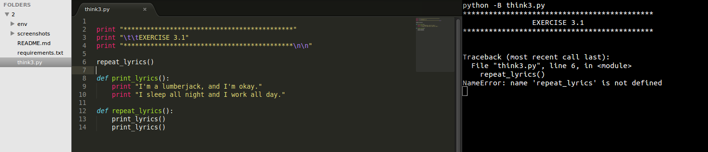

## Exercise 3.2 

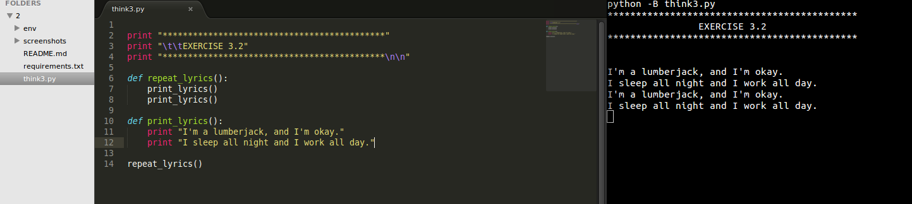

## Exercise 3.3 

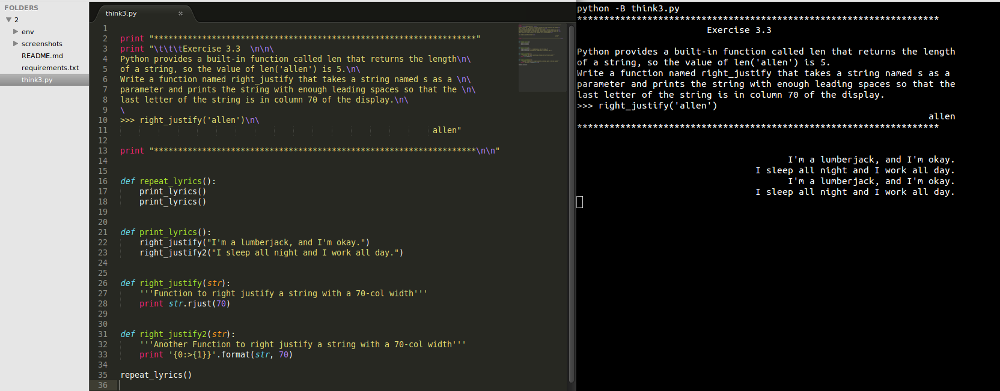

## Exercise 3.4 

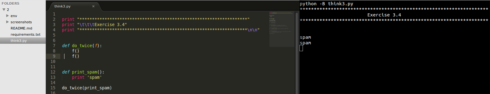

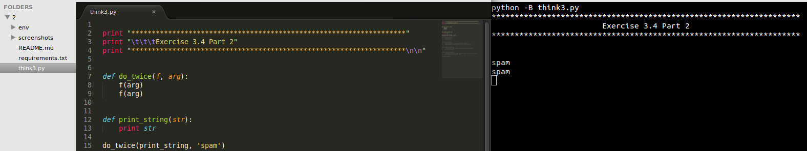

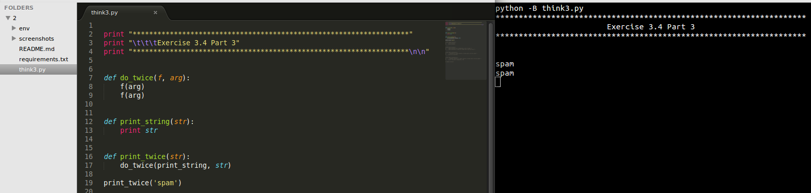

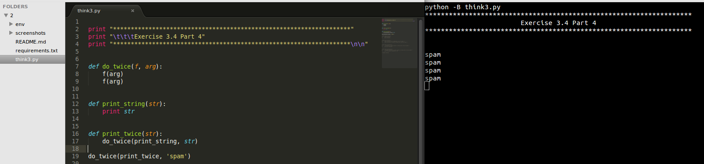

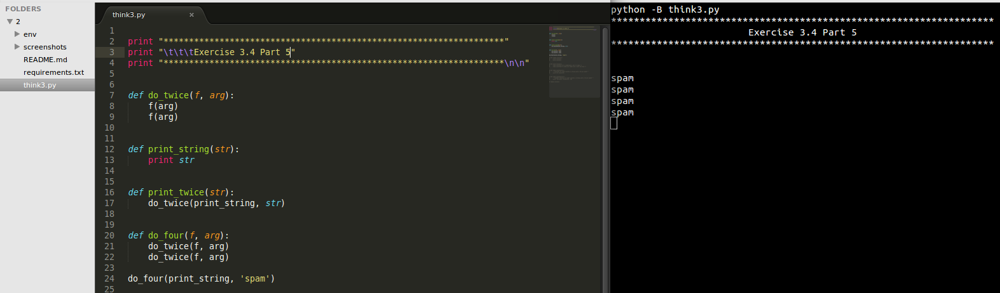

## Exercise 3.5 

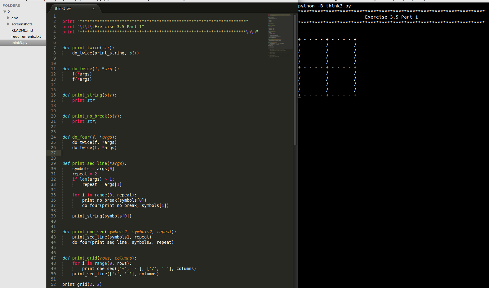

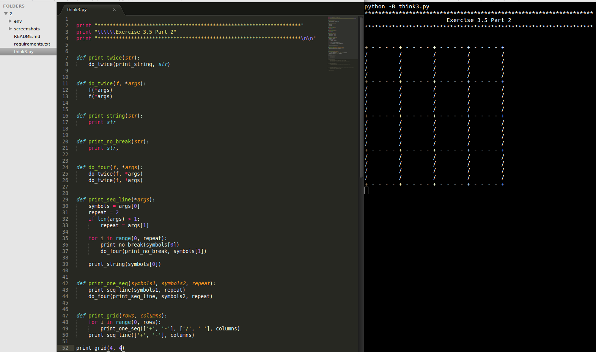

## Exercise 4.2 

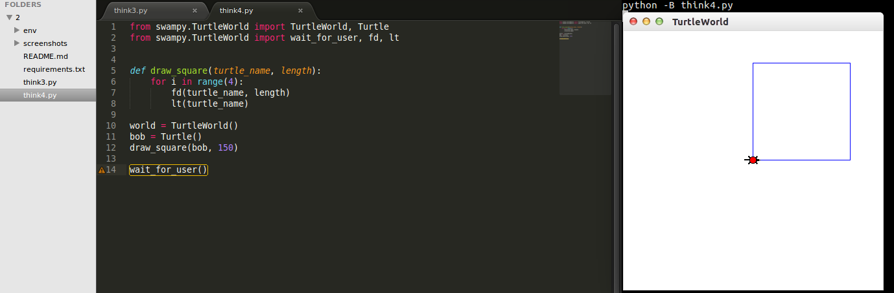

## Exercise 4.3 

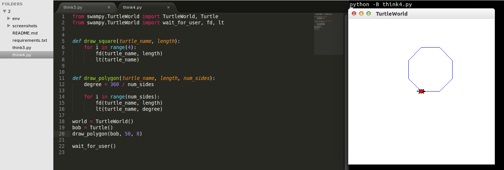
