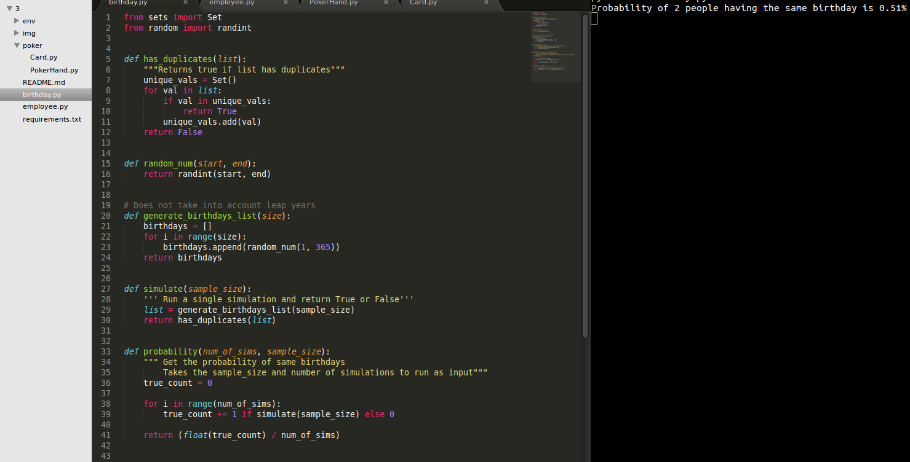
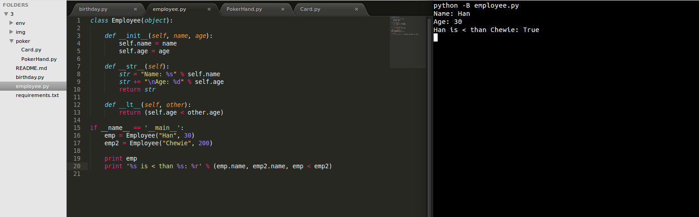
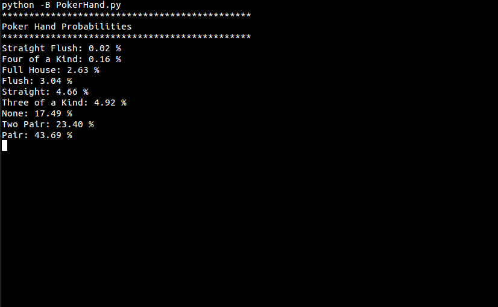

# HW3

## Table of Contents
  * [Run Instructions](#run-instructions)
  * [Birthday Paradox](#birthday)
  * [Employee](#employee)
  * [Poker!](#poker)

## Instructions <a id="run-instructions"></a>


1. Run birthday.py:
	
	```
	python birthday.py
	```

2. Run employee.py:

	```
	python employee.py
	```

3. Run PokerHand.py:

  ```
  cd poker
  python PokerHand.py
  ```
  
  
## Birthday Paradox <a id="birthday"></a>




## Employee <a id="employee"></a>




## Poker! <a id="poker"></a>


