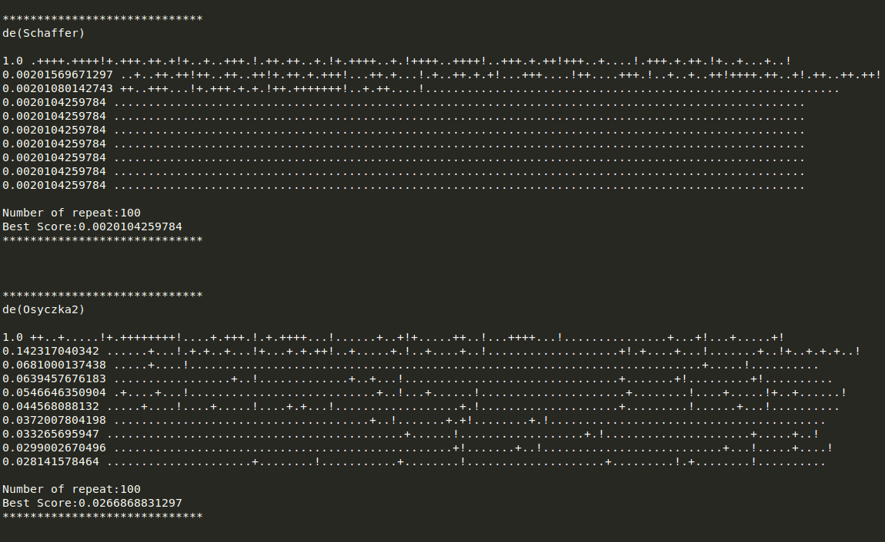

# generic-experiment-loop
Abstractions to enable running (hopefully) any optimizer on specified models

# Output:

- **These have been run with a threshold of -1, which is never attainable and so they run for the max possible number of iterations**

## Images [All DE runs + All runs over Golinski]

### DE

### SA and MWS on Golinski

## Raw Outputs [All DE runs + All runs over Golinski]

*****************************
de(Schaffer)

1.0 .++++.++++!+.+++.++.+!+..+..+++.!.++.++..+.!+.++++..+.!++++..++++!..+++.+.++!+++..+....!.+++.+.++.!+..+...+..!
0.00201569671297 ..+..++.++!++..++..++!+.++.+.+++!...++.+...!.+..++.+.+!...+++....!++....+++.!..+..+..++!++++.++..+!.++..++.++!
0.00201080142743 ++..+++...!+.+++.+.+.!++.+++++++!..+.++....!............................................................
0.0020104259784 ....................................................................................................
0.0020104259784 ....................................................................................................
0.0020104259784 ....................................................................................................
0.0020104259784 ....................................................................................................
0.0020104259784 ....................................................................................................
0.0020104259784 ....................................................................................................
0.0020104259784 ....................................................................................................

Number of repeat:100
Best Score:0.0020104259784
*****************************

*****************************
de(Osyczka2)

1.0 ++..+.....!+.++++++++!....+.+++.!.+.++++...!......+..+!+.....++..!...++++...!...............+...+!...+.....+!
0.142317040342 ......+...!.+.+..+...!+...+.+.++!..+.....+.!..+....+..!...................+!.+....+...!.......+..!+..+.+.+..!
0.0681000137438 .....+....!..........................................................................+.....!..........
0.0639457676183 .................+..!.............+..+...!...............................+.......+!.........+!..........
0.0546646350904 .+....+...!...........................+..!...+......!.....................+........!....+.....!+..+......!
0.044568088132 .....+....!....+.....!....+.+...!..................+.!....................+.........!......+...!..........
0.0372007804198 .....................................+..!.......+.+!........+.!........................................
0.033265695947 ...........................................+......!..................+.!.....................+.....+..!
0.0299002670496 .................................................+!.......+..!..........................+...!.....+....!
0.028141578464 .....................+........!...........+........!....................+.........!.+........!..........

Number of repeat:100
Best Score:0.0266868831297
*****************************

*****************************
de(Kursawe)

1.0 ..+......+!.+.+.....+!......+...!.+.+...+..!...+.+...+!+.+.++.++.!++..++....!++..+....+!....++..+.!++......++!
0.917377101177 ...+...+..!+...++....!+...+..++.!.+.+++++++!..+++.+...!..+.++....!+..+++..+.!...+...+.+!.......+..!.+.+..+..+!
0.429546266135 .....++.++!..+.+.....!.............+......!.+........!+.........!.................+..!.........+!..........
0.347574684121 .....+....!...........++.......!.+..+.....!...................+!............+.....+.!.....+....!..+.......!
0.265149409934 .......+..!........+.!.........+!.....+....!+........+!....+.....!+...+...+.!........+.!+.........!..........
0.188736225577 .+..+.....!....+.....!.............+......!......+.+.!..+.+.....!......+...!..+.......!....+.....!..........
0.127195973652 +.........!......+...!.............................+!..+......+!...++.....!.+........!.......+..!......+...!
0.087574979965 ........+.!.....+....!........................+.....!......+...!.+........!+.........!..........+.........!
0.0626724240124 .....................+........!..................+.!..+.......!........................................
0.0594746758462 ..+.......!..........................................+.......!................+...!+..+......!...+.+....!

Number of repeat:100
Best Score:0.0547890379992
*****************************

*****************************
de(Golinski)

1.0 .+.....+.+!+.+..+...+!+..++..+++!++........!+....+.+..!+......+.+!+.......+.!.....+....!..+.......!.....+....!
0.160567116478 .............+..+...!+....+....!.+....+...!+....+.+..!..+...+...!.++.+..+..!.....+....!.++.......!..........
0.056021323094 .+...+....!.+.......+!....+..+..!..+.......!.+.+......!...+......!.....++...!...+......!.........+!........++!
0.0215061895259 .............+......!............+..++...!+.........!......+...!...............+....!........+.!...++.....!
0.0115960699718 ..+.......!..........................+...!.........+!...............+....!.......+..!..+....+..!+.....+...!
0.00849785683061 ......+...!......................+.......!.......+..!..........+.........!.....+....!...............+....!
0.00745198386622 .+........!..............+.....!...........................+..!.........+!...........+........!...++.....!
0.00666469892953 ....+.....!.......................+......!...............+....!......+...!..+.......!...+....+.!.....+....!
0.00588682551152 .+........!......+...!.....+....!..........................................+.......!.....++...!..........
0.00541855252003 ...................+!+.......+.!......................++......!.............................+!..........

Number of repeat:100
Best Score:0.00453431505688
*****************************

*****************************
sa(Golinski)

0.298551835249 .....!+......?...+....?.+...+..+.?....++.......?+..
0.103217456158 ?..+.......?..?.......+.....+......!+...?..?+....+?
0.0682530737861 +...+....?...?+....?.?+.?++......?..+.+......?+...
0.0682530737861 .+....+.......??...?..........+?.+...?......!+?...+
0.016193692149 +?.?.....+.....+..+........?..+.....++.....+..+...
0.016193692149 ...?.+.+......+.?...+?+...+?....+.................
0.016193692149 .+.......?......+?...+...?...+.+................?.
0.016193692149 .++....?...+.........?...++.....++...+....+.?..?..
0.016193692149 ++.......?.....+.+....+....?+...+.....?..++?.+...+
0.016193692149 .+....?...........+..........++............?...+?.
0.016193692149 .+...+..................?+....+.?..+........++....
0.016193692149 ..?....?+...............?................+...+.?..
0.016193692149 +.....?....++............?...+..+.....?.+.+..?.?..
0.016193692149 ...+?+....?+......?.+..?...........+...........?..
0.016193692149 .+....+..........................?.++.?.+.?...+?..
0.016193692149 ....+....+?+..+......................+............
0.016193692149 ..+........................?..........?.++.....?.+
0.016193692149 +..?....+...+...+...?...............++++....?....+
0.016193692149 ?+.....+.+.........?.+++................++?.......
0.016193692149 +.........??+....+.......................??.+.....

iterations:1000
Score:0.016193692149
*****************************

*****************************
mws(Golinski)

1.0 ..+!+!.+!+!.+!+!....+..+.??+.!+!+...+.+....+.???+??+.++?+.?????
0.0212267861233 .?+?++..+.+...++..++.+...?++++..??.+.+??+..++??++++??+.
0.0212267861233 .....?+++!.+!..+.?++++.+.+.??++.+...+..
0.0142996154042 .+?+.++?++?.??+.+.+...+???+++++!..+??+++.+.++???+.+!+!.+..
0.00896299630377 ......??++?+......+.++.+....
0.00896299630377 ++....+.++....???+??+!.......
0.00742866114719 +??+.+.?+..++++.+..+......+.+...+??+.
0.00742866114719 ......?+???++++.?????+.+..???.???++?+?+.++????
0.00742866114719 ..++.+++.+.+...??++....+...??????????
0.00742866114719 ..+?++.+.++++.+++++...+++..+.++......

iterations:1000
Best Score:0.00742866114719
*****************************