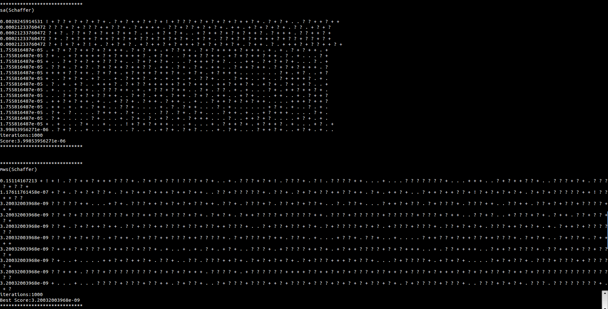
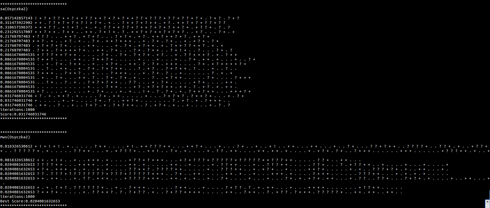
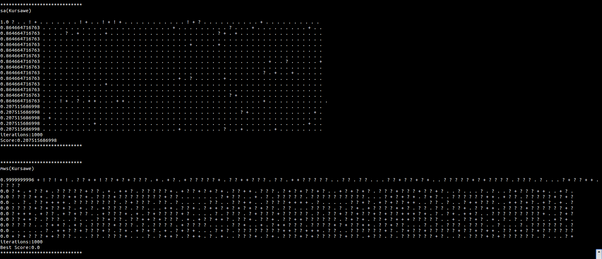

# generic-experiment-loop
Abstractions to enable running (hopefully) any optimizer on specified models

# Output:

- **These have been run with a threshold of -1, which is never attainable and so they run for the max possible number of iterations**

## Images:

#### Schaffer

#### Osyczka2

#### Kursawe

## Raw Output [Different run]

*****************************
sa(Schaffer)

0.86790308169 ! + ? ! + ! + ? ? + + ? + ? + ? + ? + ? + + . ? ? + + ? + ! + ? ? + ? + ! + ? + + ? + + ? + + ? + ? + ? + ? + 
0.000136211241554 + + ? ? + ? + ? . ? . + + ? ? + ! + ? + ? + + + . ? + + + ? ? + . ? ? + . + + . ? + ? ? + + ? + ? + + 
3.09148828189e-05 ? + + . ? ? + + ? + + ? + + + ? . + ? ? + ? + ? + ? . ? + ? + ? ? + + . . . ? + ? + ? + + . . ? . ? 
3.09148828189e-05 + ? + + ? + ? + ? + + ? + . ? + + + ? + + ? + . . . + . . ? + ? + + ? + + . + + ? + + ? + ? + + + ? 
3.09148828189e-05 + ? + . ? + . + ? + ? ? + . ? + . + . ? . . + ? ? + + ? + + . + ? + . + . ? + . . ? + . ? + . ! + ? ? 
1.98359670923e-06 + . . . + + . ? ? . + ? + ? + + + ? ? + ? + ? . . + ? + ? + ? . ? . + + . . ? + . . + . . . ? + + + 
1.98359670923e-06 ? + + . + . ? + + . + ? + . . ? + ? + + ? . + . ? + + + ? + + . ? + ? + ? . + ? + + ? + + ? . + . . 
1.98359670923e-06 ? + ? + . + + ? + + + . . ? + ? + ? + ? + . . . . ? + + . ? + + + . . + ? + + . ? + ? ? + + . ? + + 
1.98359670923e-06 + + ? + . ? + . + ? ? ? + + . . ? + ? + + . ? + + . ? . + ? + . ? + ? + . ? + + ? . ? + ? + + + ? . 
1.98359670923e-06 . + . . + ? ? + + + ? ? + ? + + . . . ? ? + . . + + . ? + + . + ? + + . . ? + . ? + + . . ? . . + ? 
1.98359670923e-06 + + + . . . ? + ? + . ? + ? + ? + + ? + + . . ? + . ? + . + . . ? + + ? + ? . + . ? . + . + . + + . 
1.98359670923e-06 . ? + ? ? + ? + . ? + ? + ? . + . . . ? + ? ? + + . + ? + . . . . ? + + . . + . . ? + ? + + . . + . 
1.98359670923e-06 ? + ? + . . ? + + . + . ? + + . . ? . . + ? + + ? + . + . ? + ? . + . . ? + + . + . . ! + ? . + . ? + 
9.75195034033e-08 + . + + + . + . ? + + . ? + . + . ? . + . ? . + . . . . . . ? . . + ? + + . . + ? ? + + . . . ? . + 
9.75195034033e-08 + + ? + . . . . . ? + . . . . . . ? + + . . + ? + + . . ? . . + . ? + ? + + . . . ? + . . . . + ? + 
9.75195034033e-08 ? + . + . ? + + . . + . ? + + ? + ? . + . ? + + + + . + . . + . . ? . ? + + ? + + . + . ? + + ? + + 
9.75195034033e-08 . . ? + ? + + + + . . + . . . . + . . ? . + ? + . . . ? + . + . . + ? + + . ? + + . ? + . + . . ? . 
9.75195034033e-08 + . . . . . . . ? + . + + . . . . . ? + . + . . ? + + ? . ? + + . ? + ? + . . . . ? + . . ? + + . . 
9.75195034033e-08 . . . . . ? + ? . + + ? + . . . . . + ? + . . . . + ? + + . . . ? + ? + + + . . ? + + . + . . . . . 
9.75195034033e-08 . ? + ? ? + . . + . . . . ? . + ? + . . ? + . . ? + . + . . . . + . . . ? . + + . + . + ? + ? + . + 
iterations:1000
Score:9.75195034033e-08
*****************************

*****************************
mws(Schaffer)

0.00366306803503 + ! + ! ? + . ? ? ? + . ? + ! ? + + ? ? + ! ? + + ! . . ? ? ? ? + ? + ? ? + ? + . ? ? ? + + ? ? ? + . . ? . + + ! . . . . ? ? ? + ? ? + . . ? + + . . . + ? ? + ! . . ? + + ? ? ? + ? + + . . ? + + + ? + ? ? ? ? + ? 
7.30902407248e-07 ? ? ? ? + + . ? ? ? + . . ? + ? ? + ? ? ? ? ? + ? + . . + . + ? ? ? ? . ? ? + ? + ? ? + ? ? ? + + . + + ? ? + ? ? + + ? ? ? ? + . . . ? + ? ? ? + ? + ? + + . ? + ? + ? ? ? ? + . + + ? + ? ? ? ? ? + ? 
7.30902407248e-07 ? ? + + . ? ? + ! ? + + . . . . ? ? + + . ? ? + + ? + ? ? ? + ? + + ? ? + . ? + ? ? ? ? + + ! ? ? + + + + . . ? ? + ? + . ? ? + ? ? + ? ? ? + . ? + . ? + ? ? + ? + + ? + . ? + ? ? + ? + + + + + ? + + ? ? 
0.0 + + ? ? + + ? + + ? ? ? + . ? ? ? ? ? + + . ? ? ? + ? + ? ? + ? + ? ? ? + ? + . ? ? ? ? + + ? + + ? + + + ? + ? + ? ? ? ? + . + ? + . . ? ? ? ? + ? ? ? + ? + + + ? + . . ? ? + ? ? ? + ? ? + . ? + + ? 
0.0 ? + ? + ? + ? ? + ? + ? ? + . ? + . ? + ? ? + + . ? ? + ? ? + + + ? + ? ? ? + ? ? + + + . ? + . ? + ? + . ? + + ? ? + ? ? + + ? + ? + . . . + . . ? ? + . ? ? + ? ? ? ? + ? + ? ? ? + ? ? + ? ? + ? ? + 
0.0 + + ? + . ? ? ? + . ? + + ? + ? + ? ? + + + ? ? + + . ? + . ? + + . ? ? ? ? + ? + ? ? ? ? ? + ? + + + . ? + + . ? ? ? + + ? ? + ? ? + ? ? + ? + ? ? + ? + . . . ? + + ? ? ? + ? ? ? + ? ? ? ? + ? ? + ? 
0.0 + ? ? + ? ? ? + ? + ? + + . + ? + ? ? + ? + + . + . + ? + . + . ? + . . . ? + + + . ? + + ? + . + . + ? ? + ? ? + + ? + ? + + . ? ? + ? ? ? + ? ? + ? ? + ? + ? ? ? ? ? + . ? + ? + ? ? + ? + . ? + ? + 
0.0 + ? ? + . + + ? + ? + ? + ? ? + . + ? + + ? ? ? ? ? ? ? + . + ? + . ? ? ? ? + ? ? ? + ? + ? ? ? + + + + . ? + + + ? + ? + + . ? ? ? + ? ? ? ? ? ? ? ? ? + ? ? ? ? + + ? ? + ? ? ? ? ? + ? + . ? + ? ? ? 
0.0 + ? ? ? + ? ? + . . + + ? . + ? ? ? ? ? ? + ? ? + ? + ? ? ? + ? + + ? ? + . . . ? + + . . ? + ? ? ? + ? ? ? ? ? ? + ? + + ? ? ? + . + + ? ? + + . ? ? + . ? + ? ? + + ? ? + . . ? ? ? + . . ? + ? ? ? ? 
0.0 + ? + + ? + + . ? + + + . ? + + ? + + . + . + ? + ? + ? ? + + . ? ? + . ? + + . + + ? + . . ? ? + . ? ? + ? ? ? ? + ? ? + + ? + ? + ? ? ? + + . + . ? + . ? ? + + ? ? + . ? ? + ? ? + + ? ? + ? ? + ? + 
iterations:1000
Best Score:0.0
*****************************

*****************************
sa(Osyczka2)

0.773242630385 ! + ? ! + ? + + ? + ! + ? + ? + ? ? + + ? + ! + ? ? + ? + ? + + ? ? + ? ? + + ? + + ? + ? . + + ? 
0.374149659864 + + ? ? + + ? . + + ! + ? . ? + ? . . + ? . + + ? + + ? + ? + ? . + . + ? ? ? . + ? 
0.340136054422 + . ? + ? + + . ? + + ! + ? + + + + ? + ? . + ? + ? + + ? ? + ? + ? + . + . ? + ? + ? + + + 
0.201814058957 ? + + . ? + + . ? + + . + + ? ? + . + . ? + . ? + ? . . + + + ? . + + + ? ? + + . ? + 
0.201814058957 ? + ? . . + ? + . + . ? ? + . . + ? + . + ? + ? . . . + ? + . . . ? + . ? + + . . . . . . ? + 
0.201814058957 . . ? . + ? + . . ! + ? . + ? + . . + ? + + ? . . + ? + . . ? + + + + ? + ? . . . + . . . . 
0.0113378684807 + . ? . . + . ? + + ? ? . + ? + + . . ? + ? + + + ? + ? . + . + + . + . . . + + . + ? + . 
0.0113378684807 . ? + . . + ? . . ? + ? + + ? + ? . . + + . ? . ? + + . . + + . ? + ? + ? + ? + . + ? + + + . 
0.0113378684807 . . + ? + + . ? . + + . + ? . . + + + . ? ? ? + + + . + ? . + + . . + ? ? + + . . 
0.0113378684807 ? + . + ? . + . . . ? + . ? ? + . + + . ? + + + . . + . ? + + . . ? ? + . . . ? + ? + + . . + . 
0.0113378684807 ? ? + ? ? + + . . . + ? + . ? . + ? + . . . . . . ? + ? + ? . . . . + + . + ? + ? + . ? 
0.0113378684807 . + ? + . . . . + . . . . . ? + . ? + ? . + ? + + + . . . . . . + ? + ? . . + + ? + . . . + 
0.0113378684807 ? + . . . . . . ? . + + ? + ? . . + . + . . . + ? ? + . + . . . + . + ? + ? . + + . . ? 
0.0113378684807 + . + + ? + . . . + . + . ? + + . . ? + + . ? + . + ? + . . . + . . . ? . + . . . . 
0.0113378684807 + . + . . . ? + . . . . ? . + . . + . ? + . . . + . . . . ? + + . . + . + + ? + . . ? + . 
0.0113378684807 + . . ? + . . . . . ? . . + . . . + . + . . ? ? . + ? + + . ? + . . . ? + ? + . + ? 
0.0113378684807 + . . . . ? . + . . . ? + + ? + + . ? . . + . . . . ? + . . ? + + ? + . + + . . + . ? 
0.0113378684807 . . . . + ? . ? + . . . . . . . . . . ? . . + . . . . ? + + ? + + + . ? + ? + . . . 
0.0113378684807 + . . . . . + . ? . . ? + . . ? + . ? + + ? + . + . . . + + . . . . . ? + + . . . . . . . . 
0.0113378684807 . + . ? + . . . . . ? + ? + . ? + . . . ? + . + . + ? + . . . . . + . . ? ? + . . . . . 
iterations:1000
Score:0.0113378684807
*****************************

*****************************
mws(Osyczka2)
+ ! . . + ! . . + ! + ! . . ? ? ? ? + + . ? ? + ? + + + . . . . . . + . . . . + . . . . ? ? + + + ! . . . . . + . . + . ? ? ? ? + ? ? + + . + ! . . . . + . . ? + + + + . . ? ? ? ? ? ? ? + ? + + + . . ? ? ? ? ? ? + . + + + . . . . + + + . + . + . . . . . ? + . + . . ? ? + + . . . + . + . + . + + + . . . + . . . + . . . + . . . . . 
0.0 + + . . ? . ? ? + ? + . . . . . + + . + + ? + ? ? ? + ? ? ? + + + . . . . . . . ? + . . . . + + . . + . . + . . . + . . + . ? ? ? + . . . . ? + . + . . + . . . + . + + . + . . . . 
0.0 ? + . ? . + ? ? + + ? + ? + + . . . . . ? + . ? ? . ? + . + + ? ? . + + + . . . ? + + ? + . . + + . + . . + . . . . . . + . + . . . ? ? + . ? + . . . . + . . . 
0.0 ? + . + + . . ? ? . ? + ? + . . + . + . . + . . . . . . . . + . . . . . . . + . + . . . . + . . . . + . . . + ? + + . + + + . + . + . . + . 
0.0 ? + ? + . + . . . . + . . + . . + . . . ? ? + . + + . . . . + + . + + . . . . . ? ? ? + ? ? + + + . + ? ? . ? + . . + . ? ? ? + . . + . + . ? ? . ? ? ? + + + . + . . + . + . . + . 
0.0 ? ? + + + . . . . . ? + . . . . + + ? ? ? + ? ? ? ? + . . ? ? + . . . . + . . . ? ? . ? ? ? + + ? ? ? ? + + + ? + . . + ? ? ? ? + . + . + . + + . . + + . . . . 
0.0 . . + . . . ? ? + . + ? ? ? + ? ? ? ? + ? + + . . . . + + . + + . . . ? ? ? ? . + + . . . . + . . . . . + + + + . . + . ? ? + + . + . . . . + + . . . . . + . . ? + . . . . ? ? ? ? 
0.0 + + . . + . . . + . ? ? ? + + . . . . . ? + ? + . ? + ? + . + . . . + + . . . . + . . . . . . . . . + . + . . + . . . + + + . + . . . + . . 
0.0 + + . + . . . . . + + ? ? + . + + . . . ? . . ? + + . + . . . ? + + + . . . ? + + . . + . . . . . . ? ? ? ? ? + + . + . ? + ? . + + . . . + ? + . . . . + + . . + + ? ? ? + . . + . 
iterations:1000
Best Score:0.0
*****************************

*****************************
sa(Kursawe)

1.0 ! + ! + . . . . . . ! + . . . . . . . . . . . . . . . . . . . . . . . . . . . . . . . . . . . . . . . . . 
0.999830457758 . . . . . . . . . . . . . . . . . . . . . . . . . . . . . . . . . . . . . . . . . . . . . . . . . . 
0.999830457758 . . . . . . . . ! + . . . . . . . . . . . . . . . . . . . . . . . . . . . . . . . . . . . . . . . . . 
0.99887277838 . . . . . . . . . . . . . . . . . . . . . . . . . ! + . . . . . . . . ! + . . . . . . . . ? + . + . . + 
0.987235055094 . . . . . . + . . . + . . . + . . . . . . . . . . . . . . . . . . . . . . . . . . . . . . . . . . . 
0.987235055094 . . . . . . . . . . . . . . . . . . . . . . . . . . . . . . . . . . . . . . . . . . . . . . . + . ? 
0.987235055094 . + . . + . . . . . . . . . . . . . ! + . ? . + . . . . . . . . . . . . . . . . + . . . . . . . . . . 
0.892748911039 + . . . . . . . . . . . . . . . . . . . . . . . . . . . . . . . . . . . . . . . . . . . . . . . . . 
0.892748911039 . . . . . . . . . . . . . . . . . . . . . . . . . . . . + . . . . . . . . . . . . . . . . . . . . . 
0.892748911039 . . . . . . . . . . . . . . . . . . . . . . . . . . . . . . . . . . . . . . . . . . . . ? + . . . . 
0.892748911039 . . . . . . . . . . . . . . . . . . . . . . . . . . . . . . . . . . . . . . . . . . . . . . . . . . 
0.892748911039 . . . . . . . . . . + . . . . . . . . . . . . . . . . . . + + . . . . . . . . . . . . . . . . . . . 
0.892748911039 . . . . . . . . . . . . . . . . . . . . . . . . . . . . . . . . . . . . . . . . . . . . . . . . . . 
0.892748911039 . . . . . . . . . . . . . . . . . . . . . . . . ? . + . . . . . . . . . . . . . . . . . . . . . . . 
0.892748911039 . . . . . . . . . . . . . . . . . . . . . . . . . . . . . . . . . . . . . . . . . . . . . . . . . . 
0.892748911039 . . . . . . . . . . . . . . . . . . . + . . . . . . . . . . . . . . . . . . . . . . . . . . . . . . 
0.892748911039 . . . . . . . . . . . . . . . . . . + . . . . . . . . . . . . . . . . . . . . . . . . . . . . . . . 
0.892748911039 . . . . . . . . . . . . . . . . . . . . . . . . . . . . . . . . . . . . . . . . . . . . . . . . . . 
0.892748911039 . . . . . . . . . . . . . . . . . . . . . . . . . . . . . . . . . . . . . . . . . . . . . . . . . . 
0.892748911039 . . . . . . . . . . . . . . . . . . . . . . . . . . . . ? . + . . . . . . . . . . . . . . . . . . . 
iterations:1000
Score:0.892748911039
*****************************

*****************************
mws(Kursawe)

1.0 ? ? . ? + ! ? ? . ? . ? ? ? ? . ? + + . + + ! + ! ? + . . . + ! . + + + ! . . + ! ? + ? ! ? + . ? . ? + + + ? ? ? . ? . ? + ? + ? . ? ? + ? ? . + + ? . . . ? ? ? ? ? . ? ? + ? ? ? ? . + . + ? ? . ? + ? ? ? + ? . . 
0.0 + . . + . ? ? ? + . . . . . ? . ? ? ? ? ? . ? ? . + ? . + + . . ? + ? + ? ? . + + ? ? ? + + . ? . + + . + + ? . + . ? . ? . . . . . . . . . . . ? ? . . . ? . . . . ? ? ? + ? . ? + ? ? ? ? . ? ? + . . 
0.0 ? + ? ? ? . . . . ? ? . ? ? ? + ? ? ? ? ? ? ? ? ? + + ? ? ? ? ? ? + ? ? + ? ? ? ? ? + + . + ? ? + ? ? + + . ? ? + + ? ? + + ? ? ? + + + . ? ? + ? + ? ? ? ? ? . + ? + + + ? . ? + ? ? ? ? ? ? + ? + . . 
0.0 ? . . + ? ? ? + ? + ? ? + . + ? . + + ? ? ? ? + + . . + + . . . ? + ? ? ? ? . . + + . + ? + ? + ? . ? ? . . ? ? ? + . ? + ? ? . . . . ? . ? ? ? ? ? + ? ? + . ? + ? ? + ? ? . ? ? ? . ? ? ? + ? . . ? + 
0.0 ? ? . . ? ? . . ? . + + + . . + . + ? . + . ? + ? ? + ? ? + + . ? + ? ? + ? + + ? + ? ? ? ? ? + + ? ? ? . ? ? ? ? ? ? ? ? + + ? + ? ? ? . . ? + + . + . . . ? . + + ? ? ? ? ? . ? ? ? + + + + + ? ? . ? 
0.0 ? . ? + ? + + ? . + ? ? + ? ? . . . . . + ? . ? ? ? ? ? ? ? ? + + ? . + ? + . ? + + ? ? + ? ? + ? + + ? + ? + + ? . . ? ? + . + ? ? + + ? . ? ? ? ? ? ? + ? . ? ? . ? ? ? . . . ? . ? + ? ? ? ? ? ? + . 
0.0 + ? . ? ? + + + ? . ? ? . . ? . ? ? ? ? + ? ? . ? . + . ? ? ? + ? ? + ? . ? ? + + ? ? + . + ? ? + + + ? + ? . ? ? + + + ? ? ? + ? + ? + ? + ? ? . . . . . ? ? + + ? ? + ? ? + + ? ? . . ? ? ? + + ? . + 
0.0 + + + + ? + + ? ? + + . + . ? ? ? + . . + + ? ? ? ? + ? . . + ? ? + + ? . + . ? ? ? ? . + ? + ? + ? + + + . ? . . ? ? ? ? ? + ? . . + ? ? ? ? . + ? + ? ? + ? . + + ? + + . + ? ? ? + ? + . ? ? + . . ? 
0.0 ? + ? . + + . + . ? + ? . ? ? ? + + ? + ? ? ? ? ? ? ? + + ? + + ? + . ? . + ? ? ? ? + ? + ? ? ? + + ? ? ? + . . + . ? + . ? . ? . . ? + ? ? + + . ? ? + ? ? + ? . . . ? + ? + + ? ? + ? ? + ? ? ? . ? ? 
0.0 ? . . + ? ? + + ? ? ? + + + ? + . + ? . ? ? + ? ? . ? . . ? ? + ? ? + ? . . ? . + + + + . ? . ? + ? ? ? ? ? ? ? ? ? + + ? ? . + + . ? ? ? . . + . ? ? ? . . + . + ? ? + ? ? ? . ? ? . ? . ? + ? + . ? + 
iterations:1000
Best Score:0.0
*****************************

