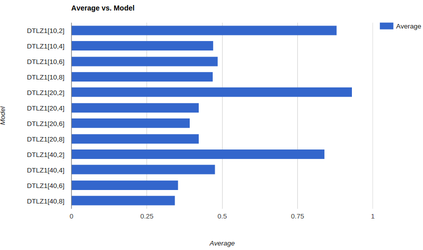
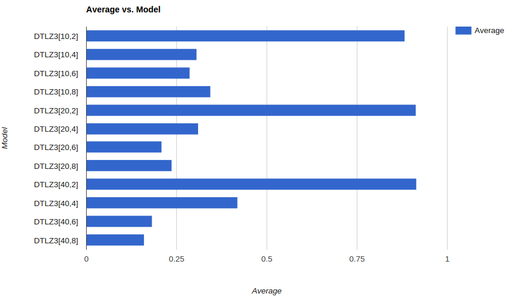
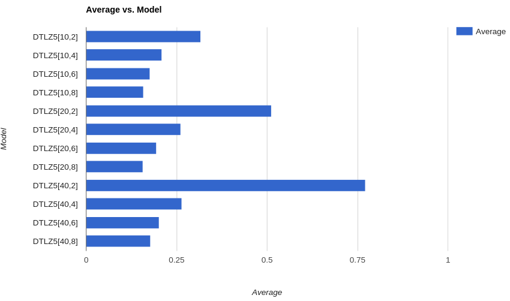
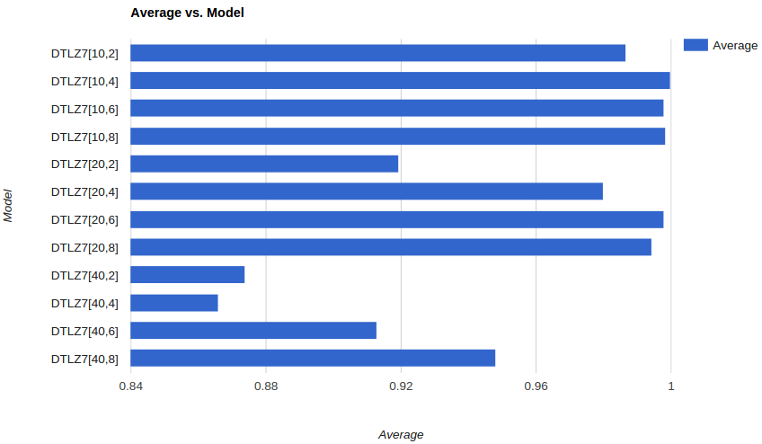

## Simple Genetic Algorithm

### Abstract
This experiment tests the effectiveness of a particular implementation of a Genetic Algorithm on various DTLZ models.

### Introduction

Genetic Algorithms (GA) are search algorithms that mimic the process of natural evolution where each individual is a candidate solution: individuals are generally raw data in whatever encoding format has been defined. They usually consist of a fitness function to select solutions that have a high probability of generating better quality next-generation solutions.

Genetic algorithms are inherently pluggable and easily modified. Basic parameters that can be changed include the probability of mutating or modifying solutions, the method of modifying the solutions, the degree of crossover (or mix and match between candidates), the fitness function used to compare candidates and the population size.

I have used binary domination as the method for comparing the fitness of 2 possible candidates. 

#### Selection
   - The first step in a GA is selecting candidates from the existing population which will be used as the basis to generate one or more child candidates
   - The idea is to use candidates with a high fitness function so as to better the next generation

#### Crossover
   - The process of taking parts from different candidates in the parent population and merging them to form a new child
   - In this experiment I have only used a single crossover point
   - In the next experiment, I have attempted to improve the overall performance by tweaking the number of crossover points between 1 and 5


#### Mutation
   - Randomly tweaking values of decision variable in the parents being used
   - Default value used is 0.05


#### Binary domination
   - Candidate A dominates B iff every decision value in A is less than or equal to the decision value in B AND there is at least one value which is less.


##### DTLZ
   
   - A model family that can contains a variable number of objective functions and decision variables
   - Designed to stress test optimizers
   - The idea is to minimize all the objectives


##### Pareto Frontier

   - The pareto frontier is defined by a set of values in the search space beyond which it is not possible to optimize a particular objective without negtively affecting another objective


#### Hypervolume 
   - This is a measure of the number of candidates that are dominated by the pareto frontier.
   - 100% indicates that the candidates on the pareto frontier dominate all other candidates
   - I've used the Monte Carlo method of calculating the hypervolume:
      - Generate a large number of valid candidates
      - Calculate the percentage of these that are dominated by candidates on the pareto frontier


### Pseudo Code

```
N = population size
P = create parent population by randomly creating N individuals

while not DONE:
    C = create empty child population
    while not enough indivs in C:
        parent1 = select parent from P***SELECTION
        parent2 = select parent from P***SELECTION
        child1, child2 = crossover(parent1,parent2)
        mutate child1, child2
        evaluate child1, child2 for fitness
        insert child1, child2 into C
    end while
    P = C


mp => Defaults for mutation: at probability 5%
cop=> Defaults for number of crossover points: one point (i.e. pick a random decision, take all dad's decisions up to that point, take alll mum's decisions after that point)
select=> Defaults for select: for all pairs in the population, apply binary tournament domination.
population_size=> Defaults for number of candidates: 100
num_generations=> Defaults for number of generations: 1000 (but have early termination considered every 100 generations)
```

### Implementation

My implementation of a Genetic Algorithm follows the above pseudo code very closely with the following details:

   - Default values:
      - Population Size: 100
      - Number of Generations: 1000
      - Probability of Mutation: 5%
      - Number of Crossover points: 1

   - Selection is done using Tournament Selection with k=2 [1], while ensuring the two parents are distinct

   - Crossover is done by choosing a single arbitrary decision number d. All decision values at index < d are chosen from the first parent and all the others are chosen from the second parent

   - Mutation is done by randomly modifying the child generated through crossover at probability 5%. The modification is made by selecting a random decision variable and generating any randomly selected valid value for it.

   - Early Termination:
      - If there is consistently no improvement in the populations between eras, I have terminated the run. 
      - If there is improvement: Number of lives += 3 
      - If no improvement: Number of lives -= 1

Now for the actual runs:
   
   - DTLZ1, 3, 5, 7 are run **20 times each** for all combinations in:
      - number of objectives = [2, 4, 6, 8]
      - number of decisions = [10, 20, 40]

   - For each run, I have calculated the hypervolume using the Monte Carlo method described above
      - I have used the last generation of the Genetic Algorithm as the pareto frontier of a particular run. The reason for this is that theoretically, the last generation is meant to be the `fittest` of all the generations and so should form the pareto frontier, or at least the effective pareto frontier.

   - For each model with a Decision/Objective pair I've calculated the average value of the hypervolume and used it to graph results

   - Raw data is available at [Run output](data/output_hv.txt)

### Results

##### DTLZ1




##### DTLZ3




##### DTLZ5




##### DTLZ7




- There is very marked correlation between the number of objectives in a model and the quality of results generated
- A change in the number of decision values does not seem to affect the quality of results noticeably
- For 2 objective functions the hypervolume ratio is extremely high
- For a higher number of objective functions there is a marked drop in performance
- The GA performs better on DTLZ1 and DTLZ7 compared to DTLZ3 and DTLZ5


#### Discussion

After observing the various populations and the number of candidates that dominate in every generation, some patterns emerge. When the number of objectives is small(2), there is a sizeable number of candidates which dominate the others in generations. These can then be used to improve the pareto frontier. When this number rises, the number of candidates that dominate drops significantly (An average of ~40 vs ~5-10)
Thus, it is obvious Binary Domination becomes less effective as the number of objective functions increases as it can become difficult to establish a sizeable number of candidates which dominate others and thus, the pareto frontier is not really effective

- There are a number of ways in which it might be possible to improve the results for a larger number of objective functions:
   - Better comparison functions for larger number of objectives. 
   - Tweaking the input parameters to the GA. I have explored this and had some success in the next experiment

#### Threats to validity

I have used the Monte-Carlo method to calculate the hypervolume which relies on generating a large number of valid candidates and comparing them to the pareto frontier generated by my algorithm as opposed to using the true pareto frontier for comparison and validation. The reason for this is that it was not possible to find a dataset containing true pareto frontiers for all variations of the models and the Monte Carlo method provides a good approximation without running an exhaustive analysis on the entire search space. This can definitely result in some inaccuracy in the results.

#### Future Work

Future work in this area can include improving the results for higher order DTLZ objective functions and also improving the efficiency of code. The results can possibly be improved by performing some preprocessing with a less intensive algorithm and generating a somehwhat optimal initial population instead of randomly generating the initial population. They might also be improved by tweaking the configurable properties of the GA, which is explored in the next experiment. Another possible improvement is experimenting with different type1 operators. Code efficiency can be improved by having the different runs execute in parallel instead of sequentially. At the start of every run an initial population is generated which is sent to all the optimizers, but there is no releation betwen the initial populations of different runs. This can be parallelized.

### Conclusion
Genetic Algorithms definitely perform better than other optimization techniques such as MaxWalkSat and Simulated Annealing. The results compared to an evolutionary algorithm like differental evolution are quite similar, at least for the runs on DTLZ7. Overall, given sufficient runs it seems to be able to find a good set of candidates for smaller number of objectives. The shortcomings explored in this are more due to the choice of the comparison function rather than GA itself. However, there is scope for improvement here in terms of tweaking the genetic algorithm itself, which I have attempted to explore in the next experiment. 

### References
[1] https://en.wikipedia.org/wiki/Tournament_selection
[2] K Deb, L Thiele, M Laumanns, E Zitzler, [Scalable test problems for evolutionary multiobjective optimization](http://e-collection.library.ethz.ch/eserv/eth:24696/eth-24696-01.pdf)
[3] https://gist.github.com/timm/5622240
[4] A. Vargha and H. D. Delaney. A critique and improvement of the CL common language effect size statistics of McGraw and Wong. Journal of Educational and Behavioral Statistics; 25(2):101-132, 2000
[5] https://cran.r-project.org/web/packages/ScottKnott/ScottKnott.pdf