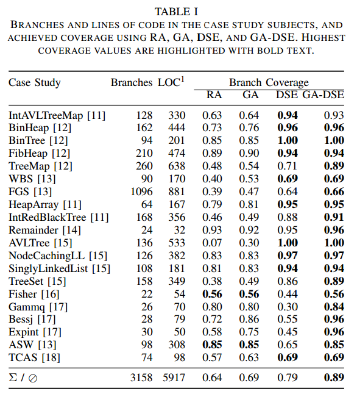

# Paper Summary
## i. Jan Malburg and Gordon Fraser. 2011. Combining Search-based and Constraint-based Testing. In Proceedings of IEEE/ACM International Conference on Automated Software Engineering (ASE).

## ii. Keywords

1. **Meta-heuristic Search-based Testing:** A form of white-box testing that generates test inputs by starting with a set of candidate inputs and then attempting to improve them based on some pre-defined fitness function. 

2. **Constraint-based Testing:** Another form of white-box testing that basically generates test inputs by solving constraints produced by symbolic execution. May have problems when the input domain is excessively large (eg: non-linear functions or floating point arithmetic functions)

3. **Genetic Algorithms:** A subset of evolutionary algorithms useful in search and optimzation problems. It starts with a set of candidate solutions to a problem (in the case of testing this is a set of possible inputs for a program). A pre-defined fitness function is used to find the *best* inputs which are then stoachastically chosen and modified based on the type of algorithm. A genetic algorithm is an example of a meta-heuristic search technique. 

4. **Dynamic Symbolic Execution (DSE):** DSE or concolic execution is an extension of classic symbolic execution. Classic symbolic execution generates symbolic functions to solve and then generates all possible inputs to test them. DSE or concolic execution starts running the program with a certain random value. Any branching conditions are collected during evaluation are represented symbolically and stored. Then one of the collected path conditions is negated to find an unexplored path and execution is resumed from that branch.

## iii. Artifacts

1. **Motivation:** Most automated test generators were (at the time the paper was written) used either meta-heuristic search techniques or constraint-based (symbolic) testing. Search-based techniques can arrive at locally (rather than globally) optimal solutions based on their fitness functions. They also face problems when multiple solutions in a generation have the same *fitness* - this leads to random selections to generate the next generation. Constraint-based Testing works well but does not scale well, especially when the input domain is very large (as in the case of non-linear functions and floating-point arithmetic). Thus, neither method can perform well for all kinds of programs.

2. **Hypothesis:** The authors suggest a method that incorporates a search-based technique using genetic algorithms where a DSE-based mutation operator is used with some probability (in their tests - 50%) instead of the standard mutation operators. Instead of randomly generating the next generation, the DSE operator uses the results of symbolic execution to mutate the generation in a way that ensures different paths of execution are followed. Their hypothesis is that local minimas and plateus faced by Search-based testing can be overcome with the DSE operator which will ensure variability in the execution flow.

3. **Related Work:** 
    - K. Lakhotia, N. Tillmann, M. Harman, and J. de Halleux, “FloPSy - search-based floating point constraint solving for symbolic execution,” in 22nd IFIP International Conference on Testing Software and Systems, ser. Lecture Notes in Computer Science. Springer Berlin / Heidelberg, 2010, pp. 142–157
    - S. Anand, C. S. Pas˘ areanu, and W. Visser, “JPF-SE: A symbolic ˘ execution extension to Java PathFinder,” in Proceedings of the 13th International Conference on Tools and Algorithms for the Construction and Analysis of Systems (TACAS’07). Berlin, Heidelberg: SpringerVerlag, 2007, pp. 134–138.
    - R. Majumdar and K. Sen, “Hybrid concolic testing,” in Proceedings of the 29th International Conference on Software Engineering (ICSE’07). Washington, DC, USA: IEEE Computer Society, 2007, pp. 416–426.

4. **Baseline Results:**
    
    

    The results provided by the authors are based on case studies from papers they have referenced. They have used branch coverage as a metric for this study which is a good metric since this is an important aspect of testing in general. 

## iv. Possible Improvements

1. The authors claim the number of generations required to find a solution is reduced by 'an order of magnitude', yet they give no concrete numbers supporting this claim. These numbers would have been useful
2. Some more examples explaining the way their operator works would have made it much easier to understand
3. They have not published nor linked to the code used in their approach. Examining the code would give some great insight into the working and also allow a peer-review of the functionality