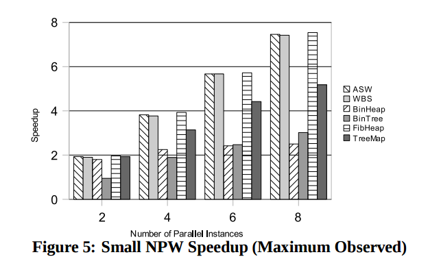

# Paper Summary
## i. Matt Staats and Corina Pasareanu. 2010. Parallel Symbolic Execution for Structural Test Generation. In Proceedings of 19th International Symposium on Software Testing and Analysis (ISSTA'10)

## ii. Keywords

1. **Symbolic Execution:**

2. **Java Path Finder:**

3. **Symbolic Execution Tree:**

4. **Test Obligation:** 

## iii. Artifacts

1. **Motivation:** 
    Symbolic Execution, while great for running a large number of execution paths through code, suffers from Scalability issues. The number of symbolic paths possible through the symbolic execution tree is extremely large for most modern programs where Automated Testing would be worth the initial overhead. Other attempts to parallelize this process resulted in a decrease in improvements as more parallelization was added due to the increased communication overhead.

2. **Hypothesis:** 
    The authors suggest a method to statically partition the data and add units of work to queues before starting the worker nodes. The advantage of this is that there is very little communication overhead (The only communication required is between the worker nodes and the main node in order to retrive symbolic execution paths to execute). Since there is very little inter-node communication, there is a direct correlation between the number of machines added to process the data and the actual speedup (This is also dependent on the actual size of work units - The smaller they are, the larger the communication overhead.)

3. **Related Work:** 
    -  A. King. Distributed parallel symbolic execution. Master’s
    thesis, Kansas State University, 2009.
    - S G. Holzmann and D. Bosnacki. The design of a multicore
    extension of the spin model checker. IEEE Transactions on
    Software Engineering, 33(10):659–674, 2007.
    - C. Pas˘ areanu, P. Mehlitz, D. Bushnell, K. Gundy-Burlet, ˘
    M. Lowry, S. Person, and M. Pape. Combining unit-level
    symbolic execution and system-level concrete execution for
    testing nasa software. In Proc. of the 2008 Int’l. Symposium
    on Software Testing and Analysis, pages 15–26. ACM New
    York, NY, USA, 2008

4. **Baseline Results:**
    
    

    The results presented by the authors are very interesting. In almost all the cases, an increase in NPW (Number of parallel workers) results in an increase in the speedup. This is the ideal case for scaling out in today's commodity hardware focussed age.

## iv. Possible Improvements

1. 2 of the test cases are proprietary. This makes it difficult to reproduce their results for these cases
2. A comparison of their approach to some of the previous work in the area would have been a good addition (For example, A.King's paper which uses dynamic queue generation instead of static queue generation)
3. It would have been interesting to see at which point the increase in NPW resulted in a plateau or even a drop in performance due to network overhead.