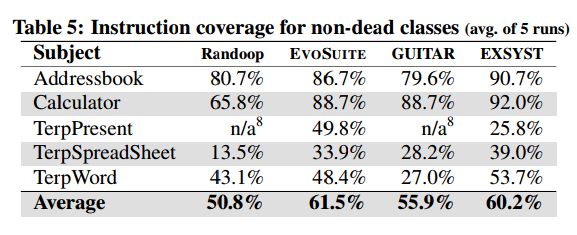

# Paper Summary
## i. Florian Gross, Gordon Fraser and Andreas Zeller. 2012. Search-Based System Testing:
High Coverage, No False Alarms. In Proceedings of the 2012 International Symposium on Software Testing and Analysis.

## ii. Keywords

    1. **System Testing:** System testing refers to testing a program/system in its entirety, hopefully in a manner that reproduces actual use cases for the program. This is in contrast to unit testing which focuses on testing a program by breaking it down into individual components and testing them separately. The disadvantage of unit testing is that the interactions between components will not be tested, and automating such testing can lead to test cases that are not possible when the components are connected and being used as whole.

    2. **Oracle:** An Oracle is basically some program or set of truths that can accurately make decisions regarding the validity of certain results. For example, in the case of automated test execution, an Oracle could be used to verify that the successful executions were producing the outputs that were expected of the program being tested.

    3. **Genetic Algorithm:** A genetic algorithm is a kind of evolutionary algorithm that is used to generate new generations of candidate solutions to a problem. The most generic template for a genetic algorithm is Mutation of input data, Crossover of the current 'population' and Selection of the best solutions for the next generation based on some fitness function. This process is then repeated until a pre-determined stop point. This point could be a maximum number of iterations, a certain threshold for suitability of a solution or some other measure. 

    4. **Test Coverage:** Test coverage refers to the number of lines of code or the percentage of the program that is being tested that is covered by test cases for it. Generally the greater the test coverage, the better.

## iii. Artifacts

    1. **Motivation:** Most test case generation techniques (at the time of this paper's publication) tended to operate on the unit level, running the risk of generating inputs that were infeasible. The inputs were infeasible because in an actual run of a program, certain paths are never taken because there is no way to reach them if execution is started from the beginning. Another problem they point out is the general lack of an "Oracle" to check the outputs of the executions performed by the test runs. 
     
    2. **Hypothesis:** The authors suggest generating test cases at the GUI level for programs where possible. Since they are generated at the GUI level, any generated test cases are guaranteed to be valid paths through the program in a real world execution. They also propose using a Genetic algorithm to learn program behavior and generate a list of test cases that achieves maximum possible coverage. Their hypothesis is that such system level testing which 'learns' the behavior corresponding to test events will result in more *efficient* testing due to there being no false alarms (i.e. Test failures along execution paths which would never occur when using the system as whole).

3. **Related Work:**
    
    1. S. Bauersfeld, S. Wappler, and J. Wegener. A metaheuristic
    approach to test sequence generation for applications with a
    GUI. In M. B. Cohen and M. O Cinneide, editors, Search
    Based Software Engineering, volume 6956 of Lecture Notes
    in Computer Science, pages 173–187. Springer Berlin /
    Heidelberg, 2011.

    2. G. Fraser and A. Arcuri. Evolutionary generation of whole
    test suites. In International Conference On Quality Software
    (QSIC), pages 31–40, Los Alamitos, CA, USA, 2011. IEEE
    Computer Society

    3. S. R. Ganov, C. Killmar, S. Khurshid, and D. E. Perry. Test
    generation for graphical user interfaces based on symbolic
    execution. In Proceedings of the 3rd international workshop
    on Automation of software test, AST ’08, pages 33–40, New
    York, NY, USA, 2008. ACM

    4. F. Gross, G. Fraser, and A. Zeller. EXSYST: Search-based
    gui testing. In ICSE 2012 Demonstration Track: Proceedings
    of the 34th International Conference on Software
    Engineering, 2012.

4. **Baseline Results:**
    
    

    - Considering the next couple of results, I felt these were the most striking in terms of proving the author's point about the number of test cases that are actually relevant to a program's functionaliy. EvoSuite, a unit testing framework on which the author's Exsyst tool is built generated more than 30X the number of tests that the system level testing tool generated.

    

    - These results also reinforce the author's hypothesis that testing at the system level with GUI testing frameworks does not lead to false alarms. In fact, certain bugs were not found by the unit testing frameworks (despite a high number of false alarms) whereas the author's system level framework did find them.

    
    

    - The tool developed by the authors seems to have outperformed the other tools in all but one of the test inputs. It appears that once the possible inputs cross a certain complexity, their tool starts to underperform a similar unit testing framework (EvoSuite) - however, it does not crash unlike the other two frameworks being used.
    

## iv. Possible Improvements

    1. All the unit testing tools should have been configured to generate a comparable number of statements per test instead of EvoSuite using 40 and Randoop using 100.
    2. More complex programs should have been explored in greater detail. The authors claim there is no reason their system would not scale, yet one of the test programs do fail for reasons of complexity.
    3. There should have been a comparison with a search or constraint based unit testing framework as well since such frameworks are also quite common in the automated testing field.