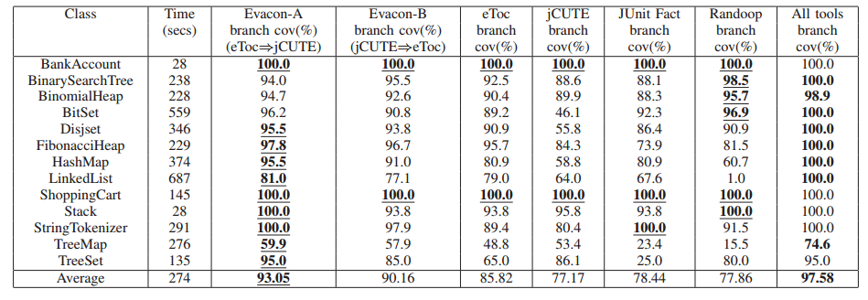
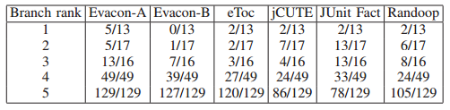

# Paper Summary
## i. Kobi Inkumsah and Tao Xie. 2008. Improving Structural Testing of Object-Oriented Programs via Integrating Evolutionary Testing and Symbolic Execution. In Proceedings of the 2008 23rd IEEE/ACM International Conference on Automated Software Engineering (ASE’08).

## ii. Keywords

1. **Symbolic Execution:** Symbolic Execution of code refers to assigning symbolic values to variables as some code is executed. The path condition or constraints that need to be satisfied are represented as a boolean expression. At each branch (eg: If else condition) in the code, one of the execution paths is followed. Typically, the aim of symbolic execution is to explore all such paths  fully in order to cover all possible inputs.

2. **Evolutionary Testing:**  subset of evolutionary algorithms useful in search and optimzation problems. It starts with a set of candidate solutions to a problem (in the case of testing this is a set of possible inputs for a program). A pre-defined fitness function is used to find the *best* inputs which are then stoachastically chosen and modified based on the type of algorithm. Evolutionary testing starts off with some set of candidate tests(method sequences) for a program and then based on the results of the tests (the fitness function), generates a new `population` of tests that would improve some metric based on the fitness function ( eg: branch coverage)

3. **Path Problem:** Evolutionary testing algorithms tend to suffer from something known as the path problem wherein due to giving certain candidate tests higher importance, the search process tends to move away from the search target. 

4. **Random Testing:** Naive Random Testing of a program involves moving through various program executions by randomly choosing input values for various arguments as they are encountered. Most tools optimize on this by looking at the results of various executions and getting rid of values that may raise Exceptions indicating invalid input values and other such optimizations. Due to the fact that there is very little processing involved in generating these tests, they are generated in a very large volume compared to other test generation methods. 

## iii. Artifacts

1. **Motivation:** Achieving high structural coverage of an object oriented program is challenging due to two main reasons - Some branches have complex program logic and others need very specific method sequences to reach certain points in the program. Symbolic Execution and Evolutionary testing are the solutions to these two challenges separately. However(at the time of writing of this paper), there was no technique to address both challenges together.

2. **Hypothesis:** The authors propose a method to combine the two techniques in a way that takes advantage of their strengths in solving the two different challenges mentioned above. Their proposal is that they will use evolutionary testing techniques in order to generate method sequences to reach points in the code which require a complex series of method calls to reach and use symbolic execution techniques in order to generate the arguments for these methods. They also combine the two by using the concrete tests generated by symbolic execution as input chromosomes to evolutionary testing.

3. **Related Work:**
    
    1. K. Sen and G. Agha, “CUTE and jCUTE: Concolic unit testing and explicit path model-checking tools,” in Proc. International Conference on Computer Aided Verification, 2006, pp. 419–423

    2. T. Xie, D. Marinov, W. Schulte, and D. Notkin, “Symstra: A framework for generating object-oriented unit tests using symbolic execution,” in Proc. International Conference on Tools and Algorithms for the Construction and Analysis of Systems, 2005, pp. 365–381.

    3. P. Tonella, “Evolutionary testing of classes,” in Proc. ACM SIGSOFT International Symposium on Software Testing and Analysis, 2004, pp. 119–128.

    4. K. Inkumsah and T. Xie, “Evacon: A framework for integrating evolutionary and concolic testing for object oriented programs,” in Proc. IEEE/ACM International Conference on Automated Software Engineering, 2007, pp. 425–428.

4. **Baseline Results:**

    

    - The results for this Evacon-A seem promising, since for a majority of cases it outperforms the other tools available. For 3 programs, Randoop has better coverage (but not significantly better). The authors suspect this is due to Randoop's logic of looking at the results of various executions and avoiding inputs that lead to exceptions in the programs being tested and also because Randoop generates a relatively large numnber of test cases compared to the other tools.
    
    

    - The authors have defined Branch Ranking as the number of tools that have managed to cover that particular branch. Thus, if a particular branch was covered only by 1 of the 6 tools, it has a branch rank of 1. 
    - These results show that while Evacon-A tends to reach a larger number of rank 1 branches, it does not cover them all. As a result, it seems that to achieve optimal branch coverage it would be useful to use 2 or more test generation tools.
    

## iv. Possible Improvements

1. The authors have not included the results of running this tool on more practical programs. While the size of the codebase might be large for these programs and even the logic might be non-trivial - however, these are not representative of real-world programs. 
2. It would have been interesting to see how much the branch coverage improved with different combinations of these tools in pairs. Running two test generation tools might be worth the overhead if they receive extremely high branch coverage.
3. An explanation of the kinds of branches that the different tools were weak at examining might have been useful, since these results seem to suggest that some tools perform disproportionally worse for certain programs.