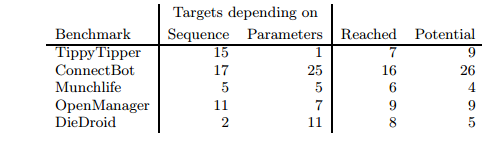

# Paper Summary
## i. Casper S. Jensen, Mukul R. Prasad and Anders Møller. 2013. Automated Testing with
Targeted Event Sequence Generation. In Proceedings of the 2013 International Symposium on Software Testing and Analysis.

## ii. Keywords

1. **Symbolic Execution:** Symbolic Execution of code refers to assigning symbolic values to variables as some code is executed. The path condition or constraints that need to be satisfied are represented as a boolean expression. At each branch (eg: If else condition) in the code, one of the execution paths is followed. Typically, the aim of symbolic execution is to explore all such paths fully in order to cover all possible inputs.

2. **:** 

3. **:** 

4. **:** 

## iii. Artifacts

1. **Motivation:** Current tools for automating software testing in mobile apps have limitations when it comes to reaching parts of the application's code that require a complex series of events to take place. The approach taken by many such tools is to use random sequences of events or model-based testing, both of which end up treating the application as a complete black box. Others use symbolic execution which inherently has the problem of generating too many inputs. The authors hope to be able to automatically find event sequences that reach a given target line in the application.
 
2. **Hypothesis:** The author's propose a method wherein the tool is given a UI model of the app and a set of targets (i.e. code blocks/UI screens) to be reached and it is able to generate an event sequence that brings the app from its initial state to the various targets. They suggest there exists a small set of events called anchor events that are responsible for setting up the program state for a target to be executed. There are multiple ways to reach the anchor events, and once reached, they can then be used to reach the target events. The way in which these anchor events are reached does not make a difference according to the authors. With this assumption, their method identifies these anchor events in reverse order, i.e. starting from the target and working backwards. They use a symbolic representation in order to reach said anchor events and store them. This helps reduce the number of possible paths that need to be explored since they only need one path to any given anchor event.

3. **Related Work:**
    
    1. 

4. **Baseline Results:**
    
    

    - It is important to keep in mind that the Collider tool was used only for targets that were not reached by other tools. Thus, the number of targets reached is a reflection of an improvement over existing tools (at least for the examples tested)
    - 'Reached' refers to successfully reaching a particular target, whereas potential refers to the number of targets that the authors feel can be reached with reasonable modifications to the tool. For example, their tool only handled Number and Boolean values in order to progress - a large number of targets that were not reached need string values.
    

## iv. Possible Improvements

1. It would be interesting to see general statistics on how this tool compares to existing tools overall (i.e. it's efficiency in terms of sequences generated, time taken, etc)
2. 