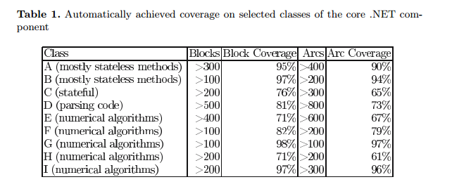

# Paper Summary
## i. Nikolai Tillmann and Jonathan de Halleux. 2008. Pex–White Box Test Generation for .NET. In Proceedings of Tests and Proofs (TAP'08).

## ii. Keywords

1. **Symbolic Execution:** Symbolic Execution of code refers to assigning symbolic values to variables as some code is executed. The path condition or constraints that need to be satisfied are represented as a boolean expression. At each branch (eg: If else condition) in the code, one of the execution paths is followed. Typically, the aim of symbolic execution is to explore all such paths  fully in order to cover all possible inputs.

2. **Dynamic Symbolic Execution (DSE):** DSE or concolic execution is an extension of classic symbolic execution. Classic symbolic execution generates symbolic functions to solve and then generates all possible inputs to test them. DSE or concolic execution starts running the program with a certain random value. Any branching conditions are collected during evaluation are represented symbolically and stored. Then one of the collected path conditions is negated to find an unexplored path and execution is resumed from that branch.

3. **Parameterized Unit Test:** A parameterized unit test is a method that takes certain parameters, performs a sequence of method calls in the code being tested and performs assertions on the results of executing the code.

4. **Reachable Statement:** A reachable statement in a program is a statement which through some series of control statements can be reached during the execution of a program.

## iii. Artifacts

1. **Motivation:** The motivation behind pex was to have a production ready tool that can run on actual .NET code in production and achieve high code coverage. 

2. **Hypothesis:** By focusing on a single framework, the authors take advantage of its known features to improve test generation. In addition, by monitoring execution traces they propose pex will build up a model of program behaviour. A constraint solver will then be used with these results to produce new test inputs which achieve high code coverage.

3. **Related Work:**
    
    1. Anand, S., Pasareanu, C.S., Visser, W.: Jpf-se: A symbolic execution extension to java pathfinder. In: Grumberg, O., Huth, M. (eds.) TACAS 2007. LNCS, vol. 4424, pp. 134–138. Springer, Heidelberg (2007)

    2. Csallner, C., Tillmann, N., Smaragdakis, Y.: Dysy: Dynamic symbolic execution for invariant inference. Technical Report MSR-TR-2007-151, Microsoft Research, Redmond, WA (November 2007)

    3. Godefroid, P.: Compositional dynamic test generation. In: POPL 2007: Proceedings of the 34th annual ACM SIGPLAN SIGACT symposium on Principles of programming languages, pp. 47–54. ACM Press, New York (2007)

    4. Sen, K., Agha, G.: CUTE and jCUTE: Concolic unit testing and explicit path model-checking tools. In: Ball, T., Jones, R.B. (eds.) CAV 2006. LNCS, vol. 4144, pp. 419–423. Springer, Heidelberg (2006)

4. **Baseline Results:**

    

    - The results of the tests seem impressive in terms of block and arc coverage. Pex seems to perform worse with code that is stateful, which might be because it is difficult to create specific combinations of state which are required for difficult to reach code statements. It has variable results in code with numerical algorithms, performing extremely well in some cases and even worse than stateful programs in other cases.
    

## iv. Possible Improvements

1. The results section can definitely use a lot of improvement. There is no meaningful description for the classes that have been tested. "Numerical algorithms" does not give the reader much insight into the programs Pex was run against.
2. The authors could have compared Pex's coverage versus the coverage of other tools available in the market. These results would have given the reader more context about Pex's performance.
3. A more detailed explanation of the **unsafe** .NET features and the way Pex handles testing of these features would have been interesting and would have given more background to replicate these findings in other languages and frameworks.