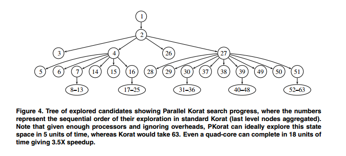

# Paper Summary
## i. Junaid Haroon Siddiqui and Sarfraz Khurshid. 2009. PKorat: Parallel Generation of Structurally Complex Test Inputs. In Proceedings of the 2009 International Conference on Software Testing Verification and Validation

## ii. Keywords

1. **Specification-based Testing:** A form of black box testing. It accepts a predicate that represents properties of desired inputs and then executes variations of these inputs to find those that produce required/expected outputs.

2. **Bounded Exhaustive Testing:** Performing tests with all non-isomorphic inputs within a given bound on the input size. A non-isomorphic refers to inputs that are functionally different from one another in the context of a program. For example, two Java objects with the same string "Test", but being stored in different address spaces are isomorphic and cannot be treated as different inputs.

3. **Non-deterministic execution:** If the direction or path that an execution takes can't be definitely calculated before it begins, it is said to be non-deterministic. This is especially true of automated testing tools who treat the program being tested as block boxes. 

4. **Imperative Predicates:** A definition of acceptable inputs. This returns true for all valid inputs. These are useful in order to test the validity of an input generated during test execution.

## iii. Artifacts

1. **Motivation:** Automated test executions that are based on non-deterministic assignments can prove to be tricky to parallelize on commodity hardware. The reason is that efficient speedup is possible when different workers are working on different parts or chunks of a problem. If the execution is non-deterministic it becomes difficult to prevent different worker threads from doing duplicate work. Usually measures that prevent such duplicate work end up being heavily communication-intensive - which ends up increasing network latency and negating the speedup due to parallel execution. 

2. **Hypothesis:** The authors suggest and demonstrate a method that achieves parallel execution while keeping network communication to a minimum. This is an interesting technique that future papers have used to parallelize other testing tools (e.g. Matt Staats and Corina Pasareanu. 2010. Parallel Symbolic Execution for Structural Test Generation. In Proceedings of 19th International Symposium on Software Testing and Analysis (ISSTA'10)). Basically, Korat (the tool which is being parallelized) tends to follow a Depth-first search type path through code execution. The authors suggest using a high level Breadth-first search type execution, with nodes generated at each level being distributed across worker nodes. Since the paths through a program are mapped out, when a particular 'node' of execution is reached by a worker thread, this 'node' is marked and this is communicated to the master process. Any slave process will then avoid exploring this node of execution in the future. This should prevent multiple worker nodes from exploring the exact same execution path through a program with minimal network overhead.

3. **Related Work:**
    
    1. S. Misailovic, A. Milicevic, N. Petrovic, S. Khurshid, and D. Marinov. Parallel test generation and execution with korat. In ESEC-FSE ’07: Proceedings of the the 6th joint meeting of the European software engineering conference and the ACM SIGSOFT symposium on The foundations of software engineering, pages 135–144, New York, NY, USA, 2007. ACM

    2. M. B. Dwyer, S. Elbaum, S. Person, and R. Purandare. Parallel randomized state space search. In ICSE ’07: Proceedings of the 29th international conference on Software Engineering, pages 3–12, Washington, DC, USA, 2007. IEEE Computer Society

    3. D. Marinov. Automatic testing of software with structurally complex inputs. PhD thesis, Massachusetts Institute of Technology, Cambridge, MA, USA, 2005

    4. P. Godefroid, N. Klarlund, and K. Sen. Dart: directed automated random testing. In PLDI ’05: Proceedings of the 2005 ACM SIGPLAN conference on Programming language design and implementation, 2005.

4. **Baseline Results:**

    

    - This figure is simply used to demonstrate that the paths explored by the parallelized tool created by the authors is identical to that explored by the serial execution supported by the original tool - only in a different order. This is important in order to establish degree of path exploration - According to these results, both versions of the tool explore the path to a similar extent.
    
    

    - These results are quite promising considering there is a direct correlation between the degree of parallelism and the speedup achieved. These results, along with the fact that code coverage achieved was identical to the original tool, prove that the author's hypothesis works - at least on the code they have tested. I would personally have preferred looking at the results on more complex programs ( The authors have basically tested it on basic tree structures)
    

## iv. Possible Improvements

1. The authors have  not included the results of running this tool on more complex programs. Such results would have been interesting. 
2. Comparison of code coverage and speed of execution compared to other tools available for the same purpose would have also been interesting.
3. It would have been interesting to see if and when the speedup due to increased parallelism plateaued as a result of the network overhead.