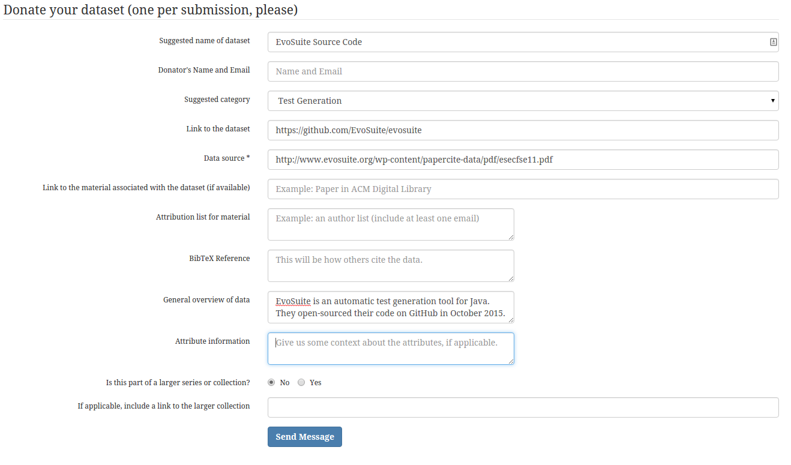

All the papers covered for the reading assignments covered different approaches to test generation and the resultant branch/statement coverage. As a result, there was not extensive dataset to publish. However, EvoSuite a popular test generation suite for Java was recently made open-source on GitHub.

In addition, [Exsyst](https://www.st.cs.uni-saarland.de/exsyst/), a tool based on EvoSuite but with improvements to reduce invalid test paths (covered in Read 7) is also in the process of being released to the open source community. The original lead developer for EvoSuite is a part of the team working on Exsyst.