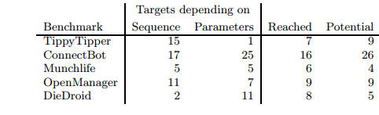

# Paper Summary
## i. Casper S. Jensen, Mukul R. Prasad and Anders Møller. 2013. Automated Testing with Targeted Event Sequence Generation. In Proceedings of the 2013 International Symposium on Software Testing and Analysis.

## ii. Keywords

1. **Symbolic Execution:** Symbolic Execution of code refers to assigning symbolic values to variables as some code is executed. The path condition or constraints that need to be satisfied are represented as a boolean expression. At each branch (eg: If else condition) in the code, one of the execution paths is followed. Typically, the aim of symbolic execution is to explore all such paths fully in order to cover all possible inputs.

2. **Concolic Execution:** Concolic execution is an extension of classic symbolic execution. Classic symbolic execution generates symbolic functions to solve and then generates all possible inputs to test them. Concolic execution starts running the program with a certain random value. Any branching conditions are collected during evaluation are represented symbolically and stored. Then one of the collected path conditions is negated to find an unexplored path and execution is resumed from that branch.

3. **Anchor Events:** An anchor event in an execution is responsible for setting the necessary program state for a target to be executed. Reaching anchor events for the target in an execution is required. However, how the execution reaches the target event is not important. This is because the Anchor event sets the program state for a particular target to be executed.

4. **Connector Events:** A connector event refers to an event which does not affect the program state. Thus, these are sets of events that can be used to connect the starting point to the anchor events mentioned above, and to connect the anchor events to each other and the target of the execution.

## iii. Artifacts

1. **Motivation:** Current tools for automating software testing in mobile apps have limitations when it comes to reaching parts of the application's code that require a complex series of events to take place. The approach taken by many such tools is to use random sequences of events or model-based testing, both of which end up treating the application as a complete black box. Others use symbolic execution which inherently has the problem of generating too many inputs. The authors hope to be able to automatically find event sequences that reach a given target line in the application.
 
2. **Hypothesis:** The author's propose a method wherein the tool is given a UI model of the app and a set of targets (i.e. code blocks/UI screens) to be reached and it is able to generate an event sequence that brings the app from its initial state to the various targets. They suggest there exists a small set of events called anchor events that are responsible for setting up the program state for a target to be executed. There are multiple ways to reach the anchor events, and once reached, they can then be used to reach the target events. The way in which these anchor events are reached does not make a difference according to the authors. With this assumption, their method identifies these anchor events in reverse order, i.e. starting from the target and working backwards. They use a symbolic representation in order to reach said anchor events and store them. This helps reduce the number of possible paths that need to be explored since they only need one path to any given anchor event.

3. **Related Work:**
    
    1. Florian Gross, Gordon Fraser, and Andreas Zeller. Search-based system testing: high coverage, no false alarms. In Proc. 21st International Symposium on Software Testing and Analysis, 2012

    2. Aravind MacHiry, Rohan Tahiliani, and Mayur Naik. Dynodroid: An input generation system for Android apps. Technical report, 2012. 
        - This was in fact the precursor to an interesting paper the same authors published in 2013 which interleaved machine and human inputs for test execution.

    3. Shay Artzi, Adam Kiezun, Julian Dolby, Frank Tip, Danny Dig, Amit M. Paradkar, and Michael D. Ernst. Finding bugs in web applications using dynamic test generation and explicit-state model checking. IEEE Transactions on Software Engineering, 36(4), 2010

    4. Nariman Mirzaei, Sam Malek, Corina S. Pasareanu, Naeem Esfahani, and Riyadh Mahmood. Testing Android apps through symbolic execution. ACM SIGSOFT Software Engineering Notes, 37(6), 2012

4. **Baseline Results:**
    
    

    - It is important to keep in mind that the Collider tool was used only for targets that were not reached by other tools. Thus, the number of targets reached is a reflection of an improvement over existing tools (at least for the examples tested)
    - 'Reached' refers to successfully reaching a particular target, whereas potential refers to the number of targets that the authors feel can be reached with reasonable modifications to the tool. For example, their tool only handled Number and Boolean values in order to progress - a large number of targets that were not reached need string values.
    

## iv. Possible Improvements

1. It would be interesting to see general statistics on how this tool compares to existing tools overall (i.e. it's efficiency in terms of sequences generated, time taken, etc)
2. Seeing concrete results after adding support for strings would be very useful since we would be able to see definite results for a fix the authors feel can actually bring their sucess rate to 100% for the programs tested.
3. Their tool works exclusively on the Dalvik bytecode at a time when it was about to be phased out as the runtime of the android operating system. It might have been more useful to see how well their methodology works on the ART runtime.