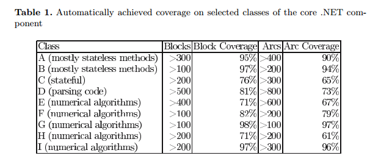
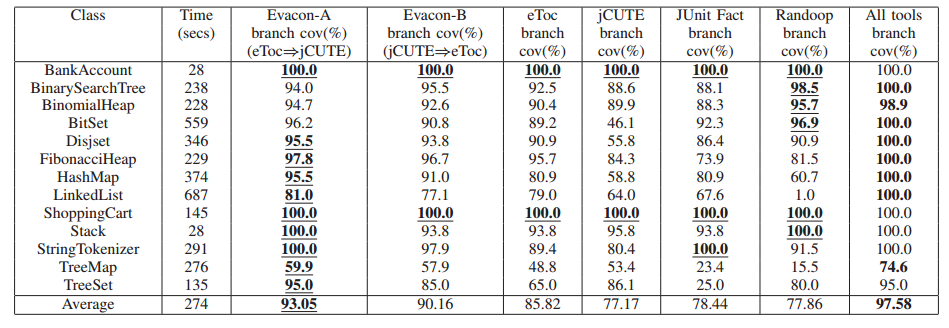
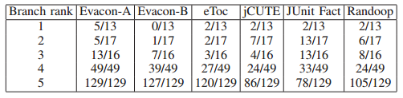
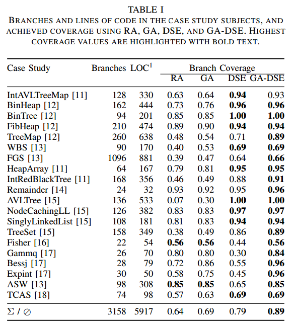
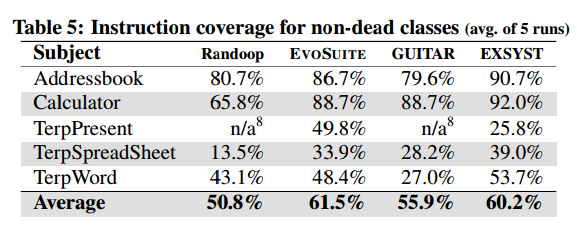
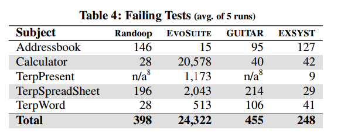
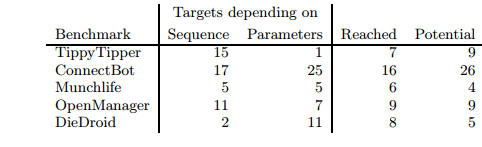

# Review: Developments in Automated Test Generation Techniques

  * [Abstract](#abstract)
  * [Introduction](#introduction)
  * [Approaches and State of Research](#approaches)
  * [Progression of Research [2008 - 2014]](#progression)
  * [Results](#results)
  * [Conclusion](#conclusion)
  * [References](#references)

## 1. Abstract 

In this paper I cover recent developments in Automated Test Generation based on papers from 2008 to 2014. Some of these papers build on the work of previous papers, whereas others try and apply existing techniques in different domains. I conclude by offering my opinions on the results of the various papers and where I feel future work would be most effective.

## 2. Introduction 

The field of automated testing is one that is increasingly important with the increase in both the complexity and functionality of modern programs and applications. Multiple frameworks, languages and approaches to application design results in a huge overhead if functionality and coverage testing is required. Often, this leads to developers achieving high coverage through inflexible, specific tests to meet project requirements, but low overall functionality or system testing.

Automating this process using smart optimization techniques that can recognize patterns in the software being tested, can vastly reduce time spent by developers on this part of the development pipeline. In this paper I cover various approaches to this problem with multiple goals including improving the quality and effectiveness of tests and testing the effectiveness of combining different existing techniques.

## 3. Approaches and State of Research 

Automated Software Testing can be approached in multiple ways depending on the goals and constraints involved, as well as the kind of program being tested. The approach to testing code that is primarily driven through UI interaction (as in the case of mobile apps) would have to be different from one that is used in the micro-controller in a NASA rocket. 

Regardless, there are some basic concepts that can be applied across all their domains. In this section I cover some of these concepts and discuss the state of research in these areas.

#### 3.1. Randomized Testing

If the goal is simply achieving high coverage and there are no major time constraints, Randomized testing has been shown to produce good results. Most such tools (such as Randoop) generate test inputs, look at the results of such inputs and modify or add test cases based on these results. If a certain type of input consistently generates Exceptions, it is changed. If instead, only certain instances of it create exceptions, that test is kept since it probably points to a flaw in program logic. 

The beauty of randomized testing is that the generation phase (of inputs) is extremely cheap in terms of computational complexity. Randomized Testing treats the code being tested as a black box. Each logical unit of code is treated separately and tested as such. Thus, these tools provide good results for unit testing.

However, it does have its downsides. For one, the sheer number of test cases generated is huge[4][7]. Depending on the software engineering model being used, and especially the frequency of builds, this may or may not be a problem. For example, in an environment using Continuous Integration, where the build process (which involves running all the test cases) is run at a high frequency this would be undesirable. Instead, generating a smaller number of better quality tests would be more desirable. There would be a high initial overhead in generating the tests, but running them would be a quicker process. The other approaches discussed are better suited to such an environment.

Another problem is such tools treating the code being tested as a black box. They do not take into account the interactions between the various components of the system as a whole. This can lead to failures during testing which would never occur in an actual run of the application. For example, in the program execution sequence where the input of a function B can only be provided by another function A in any intended use of the application, randomized testers would not take the constraints of function A into account while generating inputs for B. Thus, running the test suites generated by such test tools can give potentially misleading result statistics and force investigations into code where none are required. 

Purely randomized test generation seems to have been the first technique explored and optimized, and there does not seem to be much research focused on improving on it. My opinion is that random test generators have their place as an initial cursory health check of a system - almost as a smoke test to identify components of the system that seem to be failing very frequently. Individual components that have obvious flaws in their logic can be identified very quickly, however it is not very practical to run the entire suite generated by them for every build nor do they provide much information about how well different components are interacting.

#### 3.2. Constraint-based Testing with Symbolic Execution

This is a form of white box testing. Symbolic execution of code refers to assigning symbolic values to variables as some code is executed. The path conditions or constraints that need to be satisfied as represented as a series of boolean expressions. At each branch in the code, one of the execution paths is followed. Typically, the aim of symbolic execution is to try and explore all such paths fully. The output of symbolic execution is a symbolic execution tree which a representation of all the possible paths that can be taken during execution. These constraints are then solved to generate test inputs. 

As is expected, this form of testing would generate very high branch coverage and never generate test inputs that were invalid. It works well when the decision space is small since it attempts to explore all the paths through the code. As the decision space increases, this form of testing takes larger amounts of time to generate inputs[6], since it generates all possible inputs that solve the constraints.

#### 3.3. Dynamic Symbolic Execution (DSE)

Dynamic Symbolic Execution or Concolic Testing is an extension of classic symbolic execution. Where classic symbolic execution-based techniques generate symbolic functions and then generate all possible inputs to test them, DSE initially starts running the program with certain values. It maintains a concrete state and a symbolic state: the concrete state maps all variables to their concrete values; the symbolic state only maps variables that have non-concrete values[13]. Every time the execution branches, the branching conditions and current program state are collected, represented symbolically and stored. Once the execution is complete, one of the stored path conditions is selected, its variables negated to find an unexplored path and the process repeats itself. This approach typically runs faster than classic symbolic execution as it does not generate as many input values.

Concolic Testing successfully attempts to mitigate the issue of path explosion in classic Symbolic Execution by trying to focus on certain paths at a single time, or at least limiting possible paths by specifying certain concrete values at the start. However, it may not perform well in non-deterministic settings as it might take a path other than the intended one. A popular example of such a tool is DART[20] - Directed Automated Random Testing. DART improves upon other tools of its kind most importantly by taking into consideration the output of the function that precedes a particular method call. This reduces the number of invalid tests and paths to be explored significantly in larger programs.

Another problem is with Symbolic Execution in general - solving the constraints generated is the largest bottleneck in most real-world applications[13]. Tools such as CUTE[6] attempt to solve these issues by eliminating irrelevant constraints or maintaining solutions of constraints that have already been solved in case they are seen again at some point. The papers I have covered below have tried to parallelize the entire process with some promising results.

In recent years, with the improvement in easily accessible computation power, Symbolic Execution and its derivatives have gained a lot of popularity due to their high code coverage.

#### 3.4. Meta heuristic search based testing

This is a form of white box testing that generates test inputs for programs by starting with a set of candidate inputs and then attempting to improve them over multiple iterations. Meta heuristic search based testing encompasses a wide range of approaches, the most popular of which seems to be the utilization of Genetic algorithms to optimize the inputs over multiple iterations. Genetic Algorithms starts with a set of candidate solutions to a problem (in the case of testing this is a set of possible inputs for a program). A pre-defined fitness function is used to find the *best* inputs which are then stoachastically chosen and modified based on the type of algorithm. The fitness function here would be tuned to improve statement or branch coverage or even try and favor longer program chains as a way to attempt overall system testing. 

There are many flavors to this technique which vary based on the particular optimization model being used. The inputs at each iteration might be generated randomly while adding to a global list of the *best* inputs generated so far (based on the fitness function), or the same initial set of inputs may be mutated over multiple iterations to optimze them (as in the case of DE). The degree of mutation and crossover is also something that may be modified.

Other metaheuristic techniques used in Search based testing include Simulated Annealing, Differential Evolution and Tabu Search. There is an interesting study that we did in [14] where we tried to optimize the inputs to a Genetic Algorithm via Differential Evolution. A similar approach can be used to optimize inputs to a function that we are testing with the Energy function to maximize being (for example) path or branch coverage instead of the output of the Genetic Algorithm.

Search based techniques are particularly useful in the case of large decision spaces (eg: Functions that perform floating point arithmetic), but have the drawback that they are not guaranteed to reach a global optima in terms of coverage (or whatever other metric the tool is aiming to optimize). However, this is acceptable compared to an infeasible amount of computation to explore an entire search space for the globally optimal solution.

EvoSuite[3] is a very popular framework that uses evolutionary algorithms to generate unit tests. Since it makes no attempt to simulate the input events to a method, it tends to generate a very large number of test cases before arriving at a smaller number in the final generation. 

Another problem with many such tools is the lack of an Oracle to verify the outputs of the test runs. The Exsyst tool[4] successfully manages to overcome these particular drawback of EvoSuite, generating a much smaller number of tests while maintaining good overall coverage. The idea behind Exsyst is building a tool that can 'learn' program behavior through multiple iterations and the utilization of a genetic algorithm. It can then attempt to simulate the input events that lead to a particular method being called. By understanding valid flows through the program, it drastically reduces the number of false alarms that were mentioned in the previous section on Randomized Testing. 

Tools such as Exsyst provide two major significant advantages over other automated unit test generation tools. One, the volume of test cases generated is much smaller which means faster builds. Two(in the ideal case), programs only receive the inputs that they would in actual runs in production which means the overall effectiveness of the tests is higher. The results produced by this paper are very promising. It is however important to note that this tool is aimed at programs with a large percentage of UI elements involved in the execution flow.

## 4. Progression of Research [2008 - 2014] 

Most of the literature seems to agree that Search-based metaheuristic techniques with Evolutionary Algorithms are better when the input domain for functions are very large and there is a large search space to explore since they run faster due to their use of meta heuristics rather than an exhaustive search space exploration. However, they do not always guarantee exhaustive coverage. Symbolic Execution or DSE does try and make this guarantee but does not scale very well. An ideal testing technique would generate the results of Symbolic Execution with the lower computation requirements of a simple metaheuristic technique. 

Most authors have tried to combine the advantages of both techniques to try and overcome their individual drawbacks. Others have attempted to optimize DSE to try and make use of the massive parallelization that is possible due to the widespread availability of cloud computing and commodity hardware. In this section I will cover different implementations of both these approaches.

#### 4.1. Improving the performance of DSE
 
The main advantage of any variation of techniques that use Symbolic Execution is always the sheer number of values and tests it generates. As a direct result of this, DSE based techniques involve a large amount of computation. Initial attempts at parallelizing Symbolic execution were not very successful because it is basically a non-deterministic progression through different execution branches in a program. 

Having multiple worker nodes naively working on such a problem tends to result in many of them doing duplicate work. Measures to prevent such duplicate work often end up being network communication intensive, which in turn means an increase in time spent on network latency. Thus, the speedup obtained by ensuring non-duplicate work is negated by massive network latency time added.

The authors of [9] suggest a way to achieve parallel execution while keeping network communication to a minimum. This is an interesting technique that future papers have used to parallelize other testing tools. They have parallelized Korat which tends to follow a Depth-first search type path through code execution.The image below shows the order in which Korat would explore the Symbolic Execution tree if it ran in its unmodified form.

The authors suggest using a high level Breadth-first search type execution, with nodes generated being distributed across worker nodes. Since the paths through a program are mapped out, when a particular 'node' of execution is reached by a worker thread, this 'node' is marked and this is communicated to the master process. Any slave process will then avoid exploring this node of execution in the future. This should prevent multiple worker nodes from exploring the exact same execution path through a program with minimal network overhead. 

A. King describes an approach [1] wherein different branches in the Symbolic Execution Tree are generated dynamically and in parallel and added to a queue. However, this method seems to face a drop in speedup with a linear increase in worker nodes.

The authors of [10] tackle the same problem in a slightly different manner to try and avoid the drop in performance as the degree of parallelism is increased. They use the same concept of doing an initial run to generate execution paths, but instead of distributing them across nodes and then dynamically generating more, they generate the entire tree statically and then they add these to a queue which is then updated as the worker nodes execute. Since there is very little inter-node communication, there is a direct correlation between the number of machines added to process the data and the actual speedup. This is, however, also dependent on the actual size of work units - The smaller they are, the larger the communication overhead since there would be more frequent lookups for work. If the work units can be efficiently divided in a way that each unit takes a sufficiently large time, this technique is more scalable than the one used in PKorat[9] since high performance asynchronous message queueing frameworks like ØMQ [15] and the like provide better throughput performance compared to conventional TCP applications. 

Another approach to parallelizing state space search is mentioned by Dwyer, M.B et al. [18] called Parallel Randomized State-Space search. This technique consists of performing multiple parallel randomized state-space explorations, each with a unique random seed on a separate machine in a cluster, and stopping all the explorations when one of them detects an error. The intuition behind the technique is that different randomized explorations will exercise diverse regions of the state space and hence detect an error (if one exists) faster than just performing a single non-randomized (default) exploration.

Pex, a tool created by Microsoft research for the .NET framework has been shown to have impressive results[5]. However, instead of trying to distribute the work of the DSE, it maintains a concept of safe and unsafe .NET execution paths which it uses to prune the search space. Since Pex is specialized for the .NET framework, it becomes possible for them to leverage .NET specific features to characterize input parameters and program flows to avoid paths that will not be useful. 

#### 4.2. Combining DSE and Search-based Metaheuristics

DSE generates a Symbolic Execution tree which is essentially a representation of all the possible flows in a program. The authors of [8] propose using this tree in evaluating the candidates generated by Evolutionary Algorithms. Candidates (i.e. input parameters) at each generation that will explore a path of program execution that has not been covered so far are "fitter", and are more likely to be selected in that generation. This operator is used with some probability, and so this technique combines the advantages of using genetic algorithms (effectively exploring a large search space of possible input variables) and Symbolic Execution (guaranteeing large branch coverage). Their tool performs well in terms of branch coverage and the difference is large compared to randomized testing, as well as GA and DSE based techniques separately. Their results are discussed further in the next section. Most of the DSE based Java tools use JPF–SE as the basis of their work since it enables symbolic execution in Java programs[17].

Another problem that is often faced when testing large systems with some parts of code that are reached only with a very specific series of method calls. Another novel approach to combining DSE and Evolutionary Algorithms is discussed by K. Inkumsah et. all [7]. They use EAs to find the appropriate series of method calls to reach points in the code. They then use DSE on the methods in order to generate the right inputs to actually achieve that program flow during execution.

#### 4.3. Optimizing for specific Program Types

Specifically programs heavy in UI elements to guide flows. With the widespread increase in mobile app development, this is particularly relevant. Once we constrain ourselves to optimizing testing only UI heavy applications, it adds an extra feature which would not be possible with more generalized tools - driving input through only visible UI elements. A testing tool that is not aware of this feature would possibly generate the invalid test cases discussed earlier - specifically the generation of event sequences that would not be possible in a live run of the program (for example, through simulating the clicking of an invisible button). 

Florian Gross et al.[4] discuss their tool called Exsyst which tries and generates inputs at the GUI level as far as possible, uses a GA to learn program behaviour through various executions and then attempts to generate a list of test cases that results in maximum possible code coverage. Using a GA gives executions a higher probability of covering a wide range of inputs and limiting execution to valid GUI based events as far as possible results in fewer false alarms (i.e. failed unit tests that are infeasible flows). 

Bauersfeld, Wappler and Wegener[16] discuss a method for GUI applications where they use a metric they maximum call tree (which refers to the longest method chain) to optimize a Genetic Algorithm to generate input sequences. This tool works smartly by identifying which GUI widgets and elements are actually visible on the screen after each simulated action so as to ensure there are no invalid actions. 

CS. Jensen et al.[12] build on this idea of using GUI elements for directing test execution flows, and specialize it for Android apps. Through a large number of executions through various apps they discovered that most apps have events that they call "anchor" events. According to the authors these events can be reached via multiple flows of execution, and each of them open up a specific set of possible future flows through the program. The events leading up to these anchor events are not important, since the aim of this tool is to generate valid inputs to reach specific points in apps. Given a target, the tool works backwards and tries to identify these anchor events. Once these events are recognized, any one of the many flows to reach this event can be used as the test case. The advantage of this approach includes limiting execution to test flows that are feasible in a live instance of the app, but in addition it has the added advantage of generating only a small number of test cases - since it avoids generating multiple test cases that end up passing through the same anchor event.

A. MacHiry et al.[2] discuss their tool Dynodroid which has the goal of generating valid input sequences for android apps, without modifying the apps themselves. Such a tool could be used as a preprocessing step for other DSE based approaches by using the output of Dynodroid as a way to prune the number of paths that need to be explored.

## 5. Results 

In this section I cover the results of the various approaches covered above and offer my opinions and analysis of the results. I also cover a few points where I feel the paper could have been improved or results added to improve analysis.

#### 5.1. Improving the performance of DSE

##### Complete Parallelization

A. King's paper attempted to improve the performance of DSE by trying to distribute the entire process, including that of generating the Symbolic Execution Tree [1]. This worked well up to a certain degree of parallelism after which performance started degrading.

###### Discussion

My hypothesis is that generating the symbolic execution tree and splitting up the work in a distributed fashion loses out on an optimization that the next two papers use, which is to split the work centrally. This allows for optimizing the size of the work units as well as minimizing overlapping paths.

##### PKorat

J.H. Siddiqui et al. [9] improved an existing tool called Korat and distributed the work in a tool named PKorat with some promising results. Korat works by generating the symbolic execution tree and then proceeding through the tree in a depth first fashion. PKorat performs the first step in exactly the same manner, but then distributes the work amongst multiple workers. By distributing the work centrally, they minimize the number of overlapping paths. Even when paths do overlap, duplicate work is prevented by maintaining a list of marked nodes.

###### Discussion

These results are quite promising considering there is a direct correlation between the degree of parallelism and the speedup achieved. These results, along with the fact that code coverage achieved was identical to the original tool, prove that the author's hypothesis works - at least on the code they have tested. I would personally have preferred looking at the results on more complex programs (The authors have basically tested it on basic tree structures)

###### Possible Improvements

1. The authors have  not included the results of running this tool on more complex programs. Such results would have been interesting. 
2. Comparison of code coverage and speed of execution compared to other tools available for the same purpose would have also been interesting.
3. It would have been interesting to see if and when the speedup due to increased parallelism plateaued as a result of the network overhead.

##### Queued Work Units

M. Staats et al. [10] suggest a similar method, but instead of distributing the work statically, they simply split the work into appropriately sized work units and push them onto a queue. The worker nodes then pick work units off the queue as and when they have resources available.

###### Discussion

I expect this approach to be more scalable than the previous one as explained in the previous section. However, this is difficult to compare since the programs both have used for benchmarks is different, and there are no results for 16 parallel workers in this second approach. The results presented by the authors are very interesting. In almost all the cases, an increase in NPW (Number of parallel workers) results in an increase in the speedup. This is an ideal case for scaling out in today's commodity hardware focused age.

###### Possible Improvements

1. 2 of the test cases are proprietary. This makes it difficult to reproduce their results for these cases
2. A comparison of their approach to some of the previous work in the area would have been a good addition (For example, A.King's paper which uses dynamic queue generation instead of static queue generation)
3. It would have been interesting to see at which point the increase in NPW resulted in a plateau or even a drop in performance due to network overhead.

##### Pex

Microsoft's Pex test generator tries to improve the performance of traditional DSE by using .NET specific knowledge to minimize traversing paths that will not be useful or that they mark unsafe. This then improves performance by reducing the number of paths that need to be traversed.

###### Discussion

The results of the tests seem impressive in terms of block and arc coverage. Pex seems to perform worse with code that is stateful, which might be because it is difficult to create specific combinations of state which are required for difficult to reach code statements. It has variable results in code with numerical algorithms, performing extremely well in some cases and even worse than stateful programs in other cases.

###### Possible Improvements

1. The results section can definitely use a lot of improvement. There is no meaningful description for the classes that have been tested. "Numerical algorithms" does not give the reader much insight into the programs Pex was run against.
2. The authors could have compared Pex's coverage versus the coverage of other tools available in the market. These results would have given the reader more context about Pex's performance.
3. A more detailed explanation of the **unsafe** .NET features and the way Pex handles testing of these features would have been interesting and would have given more background to replicate these findings in other languages and frameworks.

#### 5.2. Combining DSE and Search-based Metaheuristics

##### Evacon

K. Inkumsah et al [7] use evolutionary testing techniques to find paths to difficult to reach points in code, and then use Symbolic Execution to generate valid inputs for that path.

###### Code Coverage

###### Branch Ranking

###### Discussion

The results for their tool, Evacon-A, seem promising, since for a majority of cases it outperforms the other tools available. For 3 programs, Randoop has better coverage (but not significantly better). The authors suspect this is due to Randoop's logic of looking at the results of various executions and avoiding inputs that lead to exceptions in the programs being tested and also because Randoop generates a relatively large number of test cases compared to the other tools.

The authors have defined Branch Ranking as the number of tools that have managed to cover that particular branch. Thus, if a particular branch was covered only by 1 of the 6 tools, it has a branch rank of 1. These results show that while Evacon-A tends to reach a larger number of rank 1 branches, it does not cover them all. As a result, it seems that to achieve optimal branch coverage it would be useful to use 2 or more test generation tools.

###### Possible Improvements

1. The authors have not included the results of running this tool on more practical programs. While the size of the codebase might be large for these programs and even the logic might be non-trivial - however, these are not representative of real-world programs. 
2. It would have been interesting to see how much the branch coverage improved with different combinations of these tools in pairs. Running two test generation tools might be worth the overhead if they receive extremely high branch coverage.
3. An explanation of the kinds of branches that the different tools were weak at examining might have been useful, since these results seem to suggest that some tools perform disproportionately worse for certain programs.

##### GA with SE

J. Malburg and G. Fraser[8] use the flexibility of Genetic Algorithms to generate inputs that maximize path coverage. The fitness function uses the results of symbolic execution to return a better score for inputs that explore paths that have not been covered before.

###### Discussion

The authors have used branch coverage to evaluate their tool. Their results look promising as their approach has outperformed other tools consistently. Based on just the numbers, it seems to have outperformed the previous tool discussed. However, on closer inspection the performance of Randoop on similar inputs looks quite different. It is possible that both papers had configured Randoop differently, or run it on different code bases, which makes it difficult to compare. Another possibility is that Randoop as a tool has simply improved dramatically between 2008 and 2011, in which case it is fair to say that using the DSE mutation operator in GA seems to have performed better than the previous approach discussed.

###### Possible Improvements

1. The authors claim the number of generations required to find a solution is reduced by 'an order of magnitude', yet they give no concrete numbers supporting this claim. These numbers would have been useful
2. Some more examples explaining the way their operator works would have made it much easier to understand
3. They have not published nor linked to the code used in their approach. Examining the code would give some great insight into the working and also allow a peer-review of the functionality.

#### 5.3. Optimizing for specific Program Types

##### Input Simulation in GUI based programs

F Gross et al. [4] proposed a method to improve the quality of tests by attempting to simulate the input sequence to a program rather than just generating values for it. 

###### Discussion

The tool developed by the authors seems to have outperformed the other tools in all but one of the test inputs in terms of code coverage. It appears that once the possible inputs cross a certain complexity threshold their tool starts to underperform. However, the most relevant results for their approach are the number of failed tests and number of tests generated. Their tool would be successful when the number of tests generated compared to a similar tool (EvoSuite here) and the number of false alarms, both are smaller in number. The results show that this is true.

###### Possible Improvements

1. All the unit testing tools should have been configured to generate a comparable number of statements per test instead of EvoSuite using 40 and Randoop using 100.
2. More complex programs should have been explored in greater detail. The authors claim there is no reason their system would not scale, yet one of the test programs do fail for reasons of complexity.
3. There should have been a comparison with a search or constraint based unit testing framework as well since such frameworks are also quite common in the automated testing field.

##### Reaching targets in Android apps

C.S. Jensen et al. [12] build on the idea of GUI based testing and apply it to android mobile apps. Specifically their aim is to create a tool that can reach targets that other tools were not able to reach. Their results show that they were succesful.

###### Discussion

It is important to keep in mind that the Collider tool was used only for targets that were not reached by other tools. Thus, the number of targets reached is a reflection of an improvement over existing tools (at least for the examples tested). 'Reached' refers to successfully reaching a particular target, whereas potential refers to the number of targets that the authors feel can be reached with reasonable modifications to the tool. For example, their tool only handled Number and Boolean values in order to progress - a large number of targets that were not reached need string values.

The results for both these tools suggest that, wherever possible, it is advantageous to try and model the input sequence to a method rather than simply trying a large range of values.

###### Possible Improvements
1. It would be interesting to see general statistics on how this tool compares to existing tools overall (i.e. it's efficiency in terms of sequences generated, time taken, etc)
2. Seeing concrete results after adding support for strings would be very useful since we would be able to see definite results for a fix the authors feel can actually bring their success rate to 100% for the programs tested.
3. Their tool works exclusively on the Dalvik bytecode at a time when it was about to be phased out as the runtime of the android operating system. It might have been more useful to see how well their methodology works on the ART runtime.

## 6. Conclusion 

The field of automated testing has seen some interesting developments over the last few years. While random test generation has its merits, I feel it is not very practical to run the entire suite generated by such tools for every build nor do they provide much information about how well different components are interacting. This seems to be the mindset of the community at large as well, since there does not seem to be a lot of literature on this topic in the last few years.

Symbolic Execution and its derivatives combined with Search based testing are proving to be extremely powerful at overcoming the challenges posed by random test generators, while keeping computation overhead low. Depending on the problem being tackled, they can be combined in different ways to improve overall coverage or target specific, hard to reach points in the code.

However, it is still not common to see these tools being used in the industry. I feel an important next step in this domain is to improve the usability of these tools and make them less daunting to use for developers. It is only through adoption and constant feedback that such tools can become production ready.

## 7. References 

[1] A. King. Distributed parallel symbolic execution. Master’s thesis, Kansas State University, 2009.

[2] Aravind MacHiry, Rohan Tahiliani, and Mayur Naik. Dynodroid: An input generation system for Android apps. Technical report, 2012. 

[3] G. Fraser and A. Arcuri, “EvoSuite: automatic test suite generation for object-oriented software,” in Proceedings of the 19th ACM SIGSOFT Symposium and the 13th European Conference on Foundations of Software Engineering, New York, NY, USA, 2011, pp. 416-419. 

[4] Florian Gross, Gordon Fraser and Andreas Zeller. 2012. Search-Based System Testing: High Coverage, No False Alarms. In Proceedings of the 2012 International Symposium on Software Testing and Analysis.

[5] Nikolai Tillmann and Jonathan de Halleux. 2008. Pex–White Box Test Generation for .NET. In Proceedings of Tests and Proofs (TAP'08).

[6] Koushik Sen, Darko Marinov, Gul Agha. 2013. CUTE: A Concolic Unit Testing Engine for C. In ESEC/FSE-13 Proceedings of the 10th European software engineering conference held jointly with 13th ACM SIGSOFT international symposium on Foundations of software engineering
Pages 263-272

[7] Kobi Inkumsah and Tao Xie. 2008. Improving Structural Testing of Object-Oriented Programs via Integrating Evolutionary Testing and Symbolic Execution. In Proceedings of the 2008 23rd IEEE/ACM International Conference on Automated Software Engineering (ASE’08).

[8] Jan Malburg and Gordon Fraser. 2011. Combining Search-based and Constraint-based Testing. In Proceedings of IEEE/ACM International Conference on Automated Software Engineering (ASE).

[9] Junaid Haroon Siddiqui and Sarfraz Khurshid. 2009. PKorat: Parallel Generation of Structurally Complex Test Inputs. In Proceedings of the 2009 International Conference on Software Testing Verification and Validation.

[10] Matt Staats and Corina Pasareanu. 2010. Parallel Symbolic Execution for Structural Test Generation. In Proceedings of 19th International Symposium on Software Testing and Analysis (ISSTA'10)

[11] Yepang Liu, Chang Xu  and Shing-Chi Cheung. 2014. Characterizing and Detecting Performance Bugs for Smartphone Applications. In Proceedings of the 36th International Conference on Software Engineering

[12] Casper S. Jensen, Mukul R. Prasad and Anders Møller. 2013. Automated Testing with Targeted Event Sequence Generation. In Proceedings of the 2013 International Symposium on Software Testing and Analysis.

[13] Cristian Cadar, Koushik Sen. 2013. Symbolic Execution for Software Testing: Three Decades Later. In Communications of the ACM. Vol 56. Issue 2.

[14] Tuning Parameters for a GA. Retrieved from https://github.com/rchakra3/x9115rc3/tree/master/hw/code/10

[15] ØMQ: The Theoretical Foundation - 250bpm. Retrieved from http://250bpm.com/concepts

[16] S. Bauersfeld, S. Wappler, and J. Wegener. A metaheuristic approach to test sequence generation for applications with a GUI. In M. B. Cohen and M. O Cinneide, editors, Search Based Software Engineering, volume 6956 of Lecture Notes in Computer Science, pages 173–187. Springer Berlin / Heidelberg, 2011.

[17] Anand, S., Pasareanu, C.S., Visser, W.: Jpf-se: A symbolic execution extension to java pathfinder. In: Grumberg, O., Huth, M. (eds.) TACAS 2007. LNCS, vol. 4424, pp. 134–138. Springer, Heidelberg (2007)

[18] M. B. Dwyer, S. Elbaum, S. Person, and R. Purandare. Parallel randomized state space search. In ICSE ’07: Proceedings of the 29th international conference on Software Engineering, pages 3–12, Washington, DC, USA, 2007. IEEE Computer Society

[19] Vilas Jagannath, Matt Kirn, Yu Lin, Darko Marinov. Evaluating Machine-Independent Metrics for State-Space Exploration. In Proceedings - IEEE 5th International Conference on Software Testing, Verification and Validation, ICST 2012 04/2012.

[20] Patrice Godefroid, Nils Klarlund, Koushik Sen. DART: directed automated random testing. 2005. In Proceedings of the 2005 ACM SIGPLAN conference on Programming language design and implementation Pages 213-223 