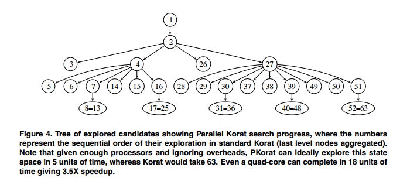

# Review: Developments in Automated Test Generation Techniques

## I. Abstract

In this paper I cover recent developments in Automated Test Generation based on papers from 2008 to 2014. Some of these papers build on the work of previous papers, whereas others try and apply existing techniques in different domains. I conclude by offering my opinions on the results of the various papers and where I feel future work would be most effective.

## II. Introduction

The field of automated testing is one that is increasingly important with the increase in both the complexity and functionality of modern programs and applications. Multiple frameworks, languages and approaches to application design results in a huge overhead if functionality and coverage testing is required. Often, this leads to developers achieving high coverage through inflexible, specific tests to meet project requirements, but low overall functionality or system testing.

Automating this process using smart optimization techniques that can recognize patterns in the software being tested, can vastly reduce time spent by developers on this part of the development pipeline. In this paper I cover various approaches to this problem with multiple goals including improving the quality and effectiveness of tests and testing the effectiveness of combining different existing techniques.

## III. Motivation

## IV. Existing Approaches

Automated Software Testing can be approached in multiple ways depending on the goals and constraints involved, as well as the kind of program being tested. The approach to testing code that is primarily driven through UI interaction (as in the case of mobile apps) would have to be different from one that is used in the microcontroller in a NASA rocket. Regardless, there are some basic concepts that can be applied across all their domains. In this section I cover some of these concepts and then move onto specialized applications of them in later sections.

#### Randomized Testing:
If the goal is simply achieving high coverage and there are no major time constraints, Randomized testing has been shown to produce good results. Most such tools (such as Randoop) generate test inputs, look at the results of such inputs and modify or add test cases based on these results. If a certain type of input consistently generates Exceptions, it is changed. If instead, only certain instances of it create exceptions, that test is kept since it probably points to a flaw in program logic. The beauty of randomized testing is that the generation phase (of inputs) is extremely cheap in terms of computational complexity. Randomized Testing treats the code being tested as a black box. Each logical unit of code is treated separately and tested as such. Thus, these tools provide good results for unit testing.

However, it does have its downsides. For one, the sheer number of test cases generated is huge[4]. Depending on the software engineering model being used, and especially the frequency of builds, this may or may not be a problem. For example, in an environment using Continuous Integration, where the build process (which involves running all the test cases) is run at a high frequency this would be undesirable. Instead, generating a smaller number of better quality tests would be more desirable. There would be a high initial overhead in generating the tests, but running them would be a quicker process. The other approaches discussed are better suited to such an environment.

Another problem is such tools treating the code being tested as a black box. They do not take into account the interactions between the various components of the system as a whole. This can lead to failures during testing which would never occur in an actual run of the application. For example, in the program execution sequence where the input of a function B can only be provided by another function A in any intended use of the application, randomized testers would not take the constraints of function A into account while generating inputs for B. Thus, running the test suites generated by such test tools can give potentially misleading result statistics and force investigations into code where none are required. 

Purely randomized test generation seems to have been the first technique explored and optimized, and there does not seem to be much research focussed on improving on it. My opinion is that random test generators have their place as an initial cursory health check of a system - almost as a smoke test to identify components of the system that seem to be failing very frequently. Individual components that have obvious flaws in their logic can be identified very quickly, however it is not very practical to run the entire suite generated by them for every build nor do they provide much information about how well different components are interacting.

#### Constraint-based Testing with Symbolic Execution

This is a form of white box testing. Symbolic execution of code refers to assigning symbolic values to variables as some code is executed. The path conditions or constraints that need to be satisfied as represented as a series of boolean expressions. At each branch in the code, one of the execution paths is followed. Typically, the aim of symbolic execution is to try and explore all such paths fully. The output of symbolic execution is a symbolic execution tree which a representation of all the possible paths that can be taken during execution. These contraints are then solved to generate test inputs. 

As is expected, this form of testing would generate very high branch coverage and never generate test inputs that were invalid. It works well when the decision space is small since it attempts to explore all the paths through the code. As the decision space increases, this form of testing takes larger amounts of time to generate inputs[6], since it generates all possible inputs that solve the constraints.

#### Dynamic Symbolic Execution (DSE)

Dynamic Symbolic Execution or Concolic Testing is an extension of classic symbolic execution. Where classic symbolic execution-based techniques generate symbolic functions and then generate all possible inputs to test them, DSE initially starts running the program with certain values. It maintains a
concrete state and a symbolic state: the concrete state maps
all variables to their concrete values; the symbolic state only
maps variables that have non-concrete values[13]. Every time the execution branches, the branching conditions and current program state are collected, represented symbolically and stored. Once the execution is complete, one of the stored path conditions is selected, its variables negated to find an unexplored path and the process repeats itself. This approach typically runs faster than classic symbolic execution as it does not generate as many input values.

Concolic Testing successfully attempts to mitigate the issue of path explosion in classic Symbolic Execution by trying to focus on certain paths at a single time, or at least limiting possible paths by specifying certain concrete values at the start. However, it may not perform well in non-deterministic settings as it might take a path other than the intended one. Another problem is with Symbolic Execution in general - solving the constraints generated is the largest bottleneck in most real-world applications[13]. Tools such as CUTE[6] attempt to solve these issues by eliminating irrelevant constraints or mainting solutions of constraints that have already been solved in case they are seen again at some point. The papers I have covered below have tried to parallelize the entire process with some promising results.

#### Meta heuristic search based testing

This is a form of white box testing that generates test inputs for programs by starting with a set of candidate inputs and then attempting to improve them over multiple iterations. Meta heuristic search based testing encompasses a wide range of approaches, the most popular of which seems to be the utilization of Genetic algorithms to optimize the inputs over multiple iterations. Genetic Algorithms starts with a set of candidate solutions to a problem (in the case of testing this is a set of possible inputs for a program). A pre-defined fitness function is used to find the *best* inputs which are then stoachastically chosen and modified based on the type of algorithm. The fitness function here would be tuned to improve statement or branch coverage or even try and favour longer program chains as a way to attempt overall system testing. 

There are many flavours to this technique which vary based on the particular optimization model being used. The inputs at each iteration might be generated randomly while adding to a global list of the *best* inputs generated so far (based on the fitness function), or the same initial set of inputs may be mutated over multiple iterations to optimze them (as in the case of DE). The degree of mutation and crossover is also something that may be modified.

Other metaheuristic techniques used in Search based testing include Simulated Annealing, Differential Evolution and Tabu Search. There is an interesting study that we did in [14] where we tried to optimize the inputs to a Genetic Algorithm via Differential Evolution. A similar approach can be used to optimize inputs to a function that we are testing with the Energy function to maximimze being (for example) path or branch coverage instead of the output of the Genetic Algorithm.

Search based techniques are particularly useful in the case of large decision spaces (eg: Functions that perform floating point arithmetic), but have the drawback that they are not guaranteed to reach a global optima in terms of coverage (or whatever other metric the tool is aiming to optimize). However, this is acceptable compared to an infeasible amount of computation to explore an entire search space for the globally optimal solution.

EvoSuite[3] is a very popular framework that uses evoutionary algorithms to generate unit tests. Since it makes no attempt to simulate the input events to a method, it tends to generate a very large number of test cases before arriving at a smaller number in the final generation. Another problem with many such tools is the lack of an Oracle to verfify the outputs of the test runs. The 2012 paper, Search-Based System Testing: High Coverage, No False Alarms by Florian et. all[4] successfully manages to overcome these particular drawback of EvoSuite in their tool (Exsyst), generating a much smaller number of tests while maintaining good overall coverage. The idea behind Exsyst is building a tool that can 'learn' program behaviour through multiple iterations and the utilization of a genetic algorithm. It can then attempt to simulate the input events that lead to a particular method being called. By understanding valid flows through the program, it drastically reduces the number of false alarms that were mentioned in the previous section on Randomized Testing. Such a tool provides two major significant advantages over other automated unit test generation tools. One, the volume of test cases generated is much smaller which means faster builds. Two(in the ideal case), programs only receive the inputs that they would in actual runs in production which means the overall effectiveness of the tests is higher. The results produced by this paper are very promising. It is however important to note that this tool is aimed at programs with a large percentage of UI elements involved in the execution flow.

## New approaches used by the authors

Most of the literature seems to agree that Search-based metaheuristic techniques with Evolutionary Algorithms are better when the input domain for functions are very large and there is a large search space to explore since they run faster due to their use of meta heuristics rather than an exhaustive search space exploration. However, they do not always guarantee exhaustive coverage. Symbolic Execution or DSE does try and make this guarantee but does not scale very well. An ideal testing technique would generate the results of Symbolic Execution with the lower computation requirements of a simple metaheuristic technique. 

Most authors have tried to combine the advantages of both techniques to try and overcome their individual drawbacks. Others have attempted to optimize DSE to try and make use of the massive parallelization that is possible due to the widespread availability of cloud computing and commodity hardware. In this section I will cover different implementations of both these approaches.

#### Improving the performance of DSE
 
The main advantage of any variation of techniques that use Symbolic Execution is always the sheer number of values and tests it generates. As a direct result of this, DSE based techniques involve a large amount of computation. Initial attempts at parallelizing Symbolic execution were not very successful because it is basically a non-deterministic progression through different execution branches in a program. 

Having multiple worker nodes naively working on such a problem tends to result in many of them doing duplicate work. Measures to prevent such duplicate work often end up being network communication intensive, which in turn means an increase in time spent on network latency. Thus, the speedup obtained by ensuring non-duplicate work is negated by massive network latency time added.

The authors of [9] suggest a way to achieve parallel execution while keeping network communication to a minimum. This is an interesting technique that future papers have used to parallelize other testing tools. They have parallelized Korat which tends to follow a Depth-first search type path through code execution. The authors suggest using a high level Breadth-first search type execution, with nodes generated being distributed across worker nodes. Since the paths through a program are mapped out, when a particular 'node' of execution is reached by a worker thread, this 'node' is marked and this is communicated to the master process. Any slave process will then avoid exploring this node of execution in the future. This should prevent multiple worker nodes from exploring the exact same execution path through a program with minimal network overhead.

A. King describes an approach [15] wherein different branches in the Symbolic Execution Tree are generated dynamically and in parallel and added to a queue. However, this method seems to face a drop in speedup with a linear increase in worker nodes.

The authors of [10] tackle the same problem in a slightly different manner to try and avoid the drop in performance as the degree of parallelism is increased. They use the same concept of doing an initial run to generate execution paths, but instead of distributing them across nodes and then dynamically generating more, they generate the entire tree statically and then they add these to a queue which is then updated as the worker nodes execute. Since there is very little inter-node communication, there is a direct correlation between the number of machines added to process the data and the actual speedup. This is, however, also dependent on the actual size of work units - The smaller they are, the larger the communication overhead since there would be more frequent lookups for work. If the work units can be efficiently divided in a way that each unit takes a sufficiently large time, this technique is more scalable than the one used in PKorat[9] since high performance asynchrnous message queueing frameworks like ØMQ [16] and the like provide better throughput performance compared to convential TCP applications. 

Pex, a tool created by Microsoft research for the .NET framework has been shown to have impressive results[5]. However, instead of trying to distribute the work of the DSE, it maintains a concept of safe and unsafe .NET execution paths which it uses to prune the search space. Since Pex is specialized for the .NET framework, it becomes possible for them to leverage .NET specific features to characterize input parameters and program flows to avoid paths that will be useful.

#### Combining DSE and Search-based Metaheuristics

DSE generates a Symbolic Execution tree which is essentially a representation of all the possible flows in a program. The authors of [8] propose using this tree in evaluating the candidates generated by Evolutionary Algorithms. Candidates (i.e. input parameters) at each generation that will explore a path of program execution that has not been covered so far are "fitter", and are more likely to be selected in that generation. This operator is used with some probability, and so this technique combines the advantages of using genetic algorithms (effectively exploring a large search space of possible input variables) and Symbolic Execution (guaranteeing large branch coverage). Their tool performs well in terms of branch coverage and the difference is large compared to randomized testing, as well as GA and DSE based techniques separately. Their results are discussed further in the next section.

Another problem that is often faced when testing large systems with some parts of code that are reached only with a very specific series of method calls. Another novel approach to combining DSE and Evolutionary Algorithms is discussed by K. Inkumsah et. all [7]. They use EAs to find the appropriate series of method calls to reach points in the code. They then use DSE on the methods in order to generate the right inputs to actually achieve that program flow during execution.

#### Optimizing for specific Program Types

Specifically programs heavy in UI elements to guide flows. With the widespread increase in mobile app development, this is particularly relevant. Once we constrain ourselves to optimizing testing only UI heavy applications, it adds an extra feature which would not be possible with more generalized tools - driving input through only visible UI elements. A testing tool that is not aware of this feature would possibly generate the invalid test cases discussed earlier - specifically the generation of event sequences that would not be possible in a live run of the program (for example, through simulating the clicking of an invisible button). 

Florian Gross et al.[4] discuss their tool called Exsyst which tries and generates inputs at the GUI level as far as possible, uses a GA to learn program behaviour through various executions and then attempts to generate a list of test cases that results in maximum possible code coverage. Using a GA gives executions a higher probability of covering a wide range of inputs and limiting execution to valid GUI based events as far as possible results in fewer false alarms (i.e. failed unit tests that are infeasible flows).

CS. Jensen et al.[12] build on this idea of using GUI elements for directing test execution flows, and specialize it for Android apps. Through a large number of executions through various apps they discovered that most apps have events that they call "anchor" events. According to the authors these events can be reached via multiple flows of execution, and each of them open up a specific set of possible future flows through the program. The events leading up to these anchor events are not important, since the aim of this tool is to generate valid inputs to reach specific points in apps. Given a target, the tool works backwards and tries to identify these anchor events. Once these events are recognized, any one of the many flows to reach this event can be used as the test case. The advantage of this approach includes limiting execution to test flows that are feasible in a live instance of the app, but in addition it has the added advantage of generating only a small number of test cases - since it avoids generating multiple test cases that end up passing through the same anchor event.

## Results

#### Improving the performance of DSE

A. King's paper attempted to improve the performance of DSE by trying to distribute the entire process, including that of generating the Symbolic Execution Tree [15]. This worked well upto a certain degree of parallelism after which performance started degrading.

My hypothesis is that generating the symbolic execution tree and splitting up the work in a distributed fashion loses out on an optimization that the next two papers use, which is to split the work centrally. This allows for optimizing the size of the work units as well as minimizing overlapping paths.

J.H. Siddiqui et al. [9] improved an existing tool called Korat and distributed the work in a tool named PKorat with some promising results. Korat works by generating the symbolic execution tree and then proceeding throught the tree in a depth first fashion. PKorat performs the first step in exactly the same manner, but then distributes the work amongst multiple workers. By distributing the work centrally, they minimize the number of overlapping paths. Even when paths do overlap, duplicate work is prevented by maintaining a list of marked nodes.

M. Staats et al. [10] suggest a similar method, but instead of distributing the work statically, they simply split the work into appropriately sized work units and push them onto a queue. The worker nodes then pick work units off the queue as and when they have resources available. I expect this approach to be more scalable than the previous one as explained in the previous section. However, this is difficult to compare since the programs both have used for benchmarks is different, and there are no results for 16 parallel workers in this second approach.

#### Combining DSE and Search-based Metaheuristics

READ1 and READ4

#### Optimizing for specific Program Types

READ7 and READ8

# Areas of Improvement

Parallelly solve individual constraints

# Related Work

# Conclusion

[1] 

[2] 

[3] G. Fraser and A. Arcuri, “EvoSuite: automatic test suite generation for object-oriented software,” in Proceedings of the 19th ACM SIGSOFT Symposium and the 13th European Conference on Foundations of Software Engineering, New York, NY, USA, 2011, pp. 416-419. 

[4] Florian Gross, Gordon Fraser and Andreas Zeller. 2012. Search-Based System Testing: High Coverage, No False Alarms. In Proceedings of the 2012 International Symposium on Software Testing and Analysis.

[5] Nikolai Tillmann and Jonathan de Halleux. 2008. Pex–White Box Test Generation for .NET. In Proceedings of Tests and Proofs (TAP'08).

[6] Koushik Sen, Darko Marinov, Gul Agha. 2013. CUTE: A Concolic Unit Testing Engine for C. In ESEC/FSE-13 Proceedings of the 10th European software engineering conference held jointly with 13th ACM SIGSOFT international symposium on Foundations of software engineering
Pages 263-272

[7] Kobi Inkumsah and Tao Xie. 2008. Improving Structural Testing of Object-Oriented Programs via Integrating Evolutionary Testing and Symbolic Execution. In Proceedings of the 2008 23rd IEEE/ACM International Conference on Automated Software Engineering (ASE’08).

[8] Jan Malburg and Gordon Fraser. 2011. Combining Search-based and Constraint-based Testing. In Proceedings of IEEE/ACM International Conference on Automated Software Engineering (ASE).

[9] Junaid Haroon Siddiqui and Sarfraz Khurshid. 2009. PKorat: Parallel Generation of Structurally Complex Test Inputs. In Proceedings of the 2009 International Conference on Software Testing Verification and Validation.

[10] Matt Staats and Corina Pasareanu. 2010. Parallel Symbolic Execution for Structural Test Generation. In Proceedings of 19th International Symposium on Software Testing and Analysis (ISSTA'10)

[11] Yepang Liu, Chang Xu  and Shing-Chi Cheung. 2014. Characterizing and Detecting Performance Bugs for Smartphone Applications. In Proceedings of the 36th International Conference on Software Engineering

[12] Casper S. Jensen, Mukul R. Prasad and Anders Møller. 2013. Automated Testing with Targeted Event Sequence Generation. In Proceedings of the 2013 International Symposium on Software Testing and Analysis.

[13] Cristian Cadar, Koushik Sen. 2013. Symbolic Execution for Software Testing: Three Decades Later. In Communications of the ACM. Vol 56. Issue 2.

[14] Tuning Parameters for a GA. Retrieved from https://github.com/rchakra3/x9115rc3/tree/master/hw/code/10

[15] A. King. Distributed parallel symbolic execution. Master’s
thesis, Kansas State University, 2009.

[16] ØMQ: The Theoretical Foundation - 250bpm. Retrieved from http://250bpm.com/concepts